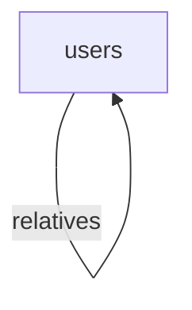

[](https://github.com/moonworm/jsonapi4j/actions/workflows/build.yml/badge.svg)
[](https://central.sonatype.com/artifact/pro.api4/jsonapi4j)
[](https://img.shields.io/github/last-commit/moonworm/jsonapi4j)
[](https://codecov.io/gh/moonworm/jsonapi4j)
[](https://github.com/moonworm/jsonapi4j/issues)
[](LICENSE)


# Introduction

Welcome to **JsonApi4j** — a lightweight API framework for Java for building [JSON:API](https://jsonapi.org/format/)-compliant APIs with minimal configuration.

There are some **application examples** available in [examples/](https://github.com/MoonWorm/jsonapi4j/tree/main/examples) folder. Please check them out for more insights on how to use the framework.

Detailed **documentation** is available [here](https://moonworm.github.io/jsonapi4j/).

# Quick start

Let's take a quick look at what a typical **JsonApi4j**-based application looks like in code.  
As an example, we'll integrate **JsonApi4j** into a clean or existing [Spring Boot](https://spring.io/projects/spring-boot) application.

## 1. Add Dependency

### Maven
```xml
<dependency>
  <groupId>pro.api4</groupId>
  <artifactId>jsonapi4j-rest-springboot</artifactId>
  <version>${jsonapi4j.version}</version>
</dependency>
```

### Gradle
```groovy
implementation "pro.api4:jsonapi4j-rest-springboot:${jsonapi4jVersion}"
```

The framework modules are published to Maven Central. You can find the latest available versions [here](https://mvnrepository.com/artifact/pro.api4).

## 2. Declare the Domain

Let's implement a simple application that exposes just one resource - `users`. And `relatives` relationship that is self-linked on the same `users` resource.



Then, let's implement a few operations for these resources - reading multiple `users`, and retrieving which are the other `users` the current user has as `relatives`.

## 3. Define the JSON:API Resource for Users

As mentioned above, let's start by defining our first JSON:API resource - `user` resource.

```java
@Component
@JsonApiResource(resourceType = "users") // 1.
public class UserResource implements Resource<UserDbEntity> { // 2.

    // 3. 
    @Override
    public String resolveResourceId(UserDbEntity userDbEntity) {
      return userDbEntity.getId();
    }
  
    // 4.
    @Override
    public UserAttributes resolveAttributes(UserDbEntity userDbEntity) {
      return new UserAttributes(
              userDbEntity.getFirstName() + " " + userDbEntity.getLastName(),
              userDbEntity.getEmail(),
              userDbEntity.getCreditCardNumber()
      );
    }

}
```

What's happening here:
1. `@JsonApiResource(resourceType = "users")` defines a unique resource type name (`users` in this case). Each resource in your API must have a distinct type.
2. `UserResource implements Resource<UserDbEntity>` each resource must implement `Resource` interface. It's parametrized with a `UserDbEntity` type - is how data is represented internally.
3. `String resolveResourceId(UserDbEntity userDbEntity)` returns the unique identifier for this resource, must be unique across all resources of this type.
4. `UserAttributes resolveAttributes(UserDbEntity userDbEntity)` - (optional) maps internal domain data (`UserDbEntity`) to the public API-facing representation (`UserAttributes`)

Here's a draft implementation of `UserAttributes`:

```java
public class UserAttributes {
    
    private final String firstName;
    private final String lastName;
    private final String email;
    private final String creditCardNumber;
    
    // constructors, getters and setters

}
```

and `UserDbEntity`:

```java
public class UserDbEntity {

    private final String id;
    private final String fullName;
    private final String email;
    private final String creditCardNumber;
    
    // constructors, getters and setters

}
```

Internal models (like `UserDbEntity` in this case) often differ from `UserAttributes`. They may encapsulate database-specific details (for example, a Hibernate entity or a JOOQ record), represent a DTO from an external service, or even aggregate data from multiple sources.

## 4. Declare the first JSON:API Operation — Read Multiple Users

Now that we've defined our resource and attributes, let's implement the first operation to read all users.
This operation will be available under `GET /users`.

```java
@Component
@JsonApiResourceOperation(resource = UserResource.class) // 1.
public class UserRepository implements ResourceRepository<UserDbEntity> { // 2.

    private final UserDb userDb; // 3.
    
    public ReadAllUsersOperation(UserDb userDb) {
        this.userDb = userDb;
    }

    @Override
    public CursorPageableResponse<UserDbEntity> readPage(JsonApiRequest request) { // 4.
        UserDb.DbPage<UserDbEntity> pagedResult = userDb.readAllUsers(request.getCursor());
        return new CursorPageableResponse.fromItemsAndCursor(
                pagedResult.getEntities(),
                pagedResult.getCursor()
        );
    }

}
```

What's happening here:
1. `@JsonApiResourceOperation(resource = UserResource.class)` - identify which JSON:API resource this operation belongs to (`users`).
2. `UserRepository implements ResourceRepository<UserDbEntity>` - this class must implement `ResourceRepository`. This interface consist of all available operations that can be implemented for any JSON:API resource. Interface parametrized with `UserDbEntity` - internal model that represents our `users` resource. 
3. The `UserDb` class doesn't depend on any **JsonApi4j**-specific interfaces or components — it simply represents your data source. In a real application, this could be an ORM entity manager, a JOOQ repository, a REST client, or any other persistence mechanism. 
4. As of now we only implement `readPage(...)` method among others available in `ResourceRepository`. 

For the sake of this demo, here’s a simple in-memory implementation of `UserDb` to support the operations from above:
```java
@Component
public class UserDb {

    private Map<String, UserDbEntity> users = new ConcurrentHashMap<>();
    {
        users.put("1", new UserDbEntity("1", "John Doe", "john@doe.com", "123456789"));
        users.put("2", new UserDbEntity("2", "Jane Doe", "jane@doe.com", "222456789"));
        users.put("3", new UserDbEntity("3", "Jack Doe", "jack@doe.com", "333456789"));
        users.put("4", new UserDbEntity("4", "Jessy Doe", "jessy@doe.com", "444456789"));
        users.put("5", new UserDbEntity("5", "Jared Doe", "jared@doe.com", "555456789"));
    }

    public DbPage<UserDbEntity> readAllUsers(String cursor) {
        LimitOffsetToCursorAdapter adapter = new LimitOffsetToCursorAdapter(cursor).withDefaultLimit(2); // let's say our page size is 2
        LimitOffsetToCursorAdapter.LimitAndOffset limitAndOffset = adapter.decodeLimitAndOffset();

        int effectiveFrom = limitAndOffset.getOffset() < users.size() ? limitAndOffset.getOffset() : users.size() - 1;
        int effectiveTo = Math.min(effectiveFrom + limitAndOffset.getLimit(), users.size());

        List<UserDbEntity> result = new ArrayList<>(users.values()).subList(effectiveFrom, effectiveTo);
        String nextCursor = adapter.nextCursor(users.size());
        return new DbPage<>(nextCursor, result);
    }

    public static class DbPage<E> {

        private final String cursor;
        private final List<E> entities;

        public DbPage(String cursor, List<E> entities) {
            this.cursor = cursor;
            this.entities = entities;
        }

        public String getCursor() {
            return cursor;
        }

        public List<E> getEntities() {
            return entities;
        }
    }
}
```

You can now run your application (for example, on port `8080` by setting Spring Boot's property to `server.port=8080`) and send the next HTTP request: [/users?page[cursor]=DoJu](http://localhost:8080/jsonapi/users?page[cursor]=DoJu).

And then you should receive a paginated, JSON:API-compliant response such as:
```json
{
  "data": [
    {
      "attributes": {
        "fullName": "Jack Doe",
        "email": "jack@doe.com",
        "creditCardNumber": "333456789"
      },
      "links": {
        "self": "/users/3"
      },
      "id": "3",
      "type": "users"
    },
    {
      "attributes": {
        "fullName": "Jessy Doe",
        "email": "jessy@doe.com",
        "creditCardNumber": "444456789"
      },
      "links": {
        "self": "/users/4"
      },
      "id": "4",
      "type": "users"
    }
  ],
  "links": {
    "self": "/users?page%5Bcursor%5D=DoJu",
    "next": "/users?page%5Bcursor%5D=DoJw"
  }
}
```

Try to remove `page[cursor]=xxx` query parameter - it will just start reading user resources from the very beginning.

## 5. Add a JSON:API Relationship - User Relatives

Now that we've defined our first resource, let's establish a `relatives` relationship between `users`.

Each user can have multiple `relatives`, which makes this a **to-many** relationship (represented by an array of resource identifier objects).

To implement this, we'll create a class that implements the `ToManyRelationship` interface:

```java
@Component
@JsonApiRelationship(relationshipName = "relatives", parentResource = UserResource.class) // 1.
public class UserRelativesRelationship implements ToManyRelationship<UserDbEntity, UserDbEntity> { // 2.

    @Override // 3.
    public String resolveResourceIdentifierType(UserDbEntity userDbEntity) {
        return "users";
    }

    @Override // 4.
    public String resolveResourceIdentifierId(UserDbEntity userDbEntity) {
        return userDbEntity.getId();
    }

}
```

1. `@JsonApiRelationship(relationshipName = "relatives", parentResource = UserResource.class)` - defines the name of the relationship - `relatives` and identifies which resource this relationship belongs to - `UserResource`
2. `UserRelativesRelationship implements ToManyRelationship<UserDbEntity, UserDbEntity>` - this relationship must implement `ToManyRelationship` interface because it has 'to-many' nature. Interface is parametrized with two types: internal model that represents relationship resource and internal model of the parent resource. In this particular case both types are represented by the same model - `UserDbEntity`.   
3. `String resolveResourceIdentifierType(UserDbEntity userDbEntity)` - determines the type of the related resource - `users`. In some cases, a relationship may include multiple resource types - for example, a `userProperty` relationship could contain a mix of `cars`, `apartments`, or `yachts`.
4. `String resolveResourceIdentifierId(UserDbEntity userDbEntity)` - resolves the unique identifier of the user

## 6. Add the Missing Relationship Operation

The final piece of the puzzle is teaching the framework how to **resolve the declared relationship data**.

To do this, implement `UserRelativesRepository` - this tells **JsonApi4j** how to find the related user relatives.

```java
@Component
@JsonApiRelationshipOperation(resource = UserResource.class, relationship = UserRelativesRelationship.class) // 1.
public class UserRelativesRepository implements ToManyRelationshipRepository<UserDbEntity, UserDbEntity> { // 2.
    
    private final UserDb userDb;
    
    public UserRelativesRepository(UserDb userDb) {
        this.userDb = userDb;
    }
    
    @Override
    public CursorPageableResponse<UserDbEntity> readMany(JsonApiRequest request) { // 3.
        List<String> relativeIds = userDb.getUserRelatives(request.getResourceId());
        List<UserDbEntity> relatives = userDb.readByIds(relativeIds);
        return CursorPageableResponse.fromItemsPageable(relatives, request.getCursor(), 2); // 4. 
    }
    
}
```

1. `@JsonApiRelationshipOperation(resource = UserResource.class, relationship = UserRelativesRelationship.class)` uniquely identify which resource and relationship this operation belongs to (`UserResource` and `UserRelativesRelationship` accordingly).
2. `UserRelativesRepository implements ToManyRelationshipRepository<UserDbEntity, UserDbEntity>` - this repository must implement `ToManyRelationship` interface because it has 'to-many' nature. Interface is parametrized with two types: internal model that represents relationship resource and internal model of the parent resource. In this particular case both types are represented by the same model - `UserDbEntity`.
3. `CursorPageableResponse<UserDbEntity> readMany(JsonApiRequest request)` - As of now we only implement `readMany(...)` method among others available in `ToManyRelationshipRepository`.
4. Let's set page limit to 2 to showcase the pagination

We also need to extend our existing `UserDb` to include information about user relatives.
```java

public class UserDb {
    
    //  ...

    private Map<String, List<String>> userRelatives = new ConcurrentHashMap<>();
    {
        userRalatives.put("1", List.of("2"));
        userRalatives.put("2", List.of("1", "4"));
        userRalatives.put("3", Collections.emptyList());
        userRalatives.put("4", List.of("1"));
        userRalatives.put("5", List.of("1", "2", "4"));
    }

    public List<String> getUserRelatives(String userId) {
        return userRalatives.get(userId);
    }

    // ...

}
```

Finally, this operation will be available under `GET /users/{userId}/relationships/relatives`.

## 7. Request/Response Examples

### Fetch a User's Relatives Relationships

Request: [/users/5/relationships/relatives](http://localhost:8080/jsonapi/users/5/relationships/relatives)

Response:
```json
{
  "links": {
    "self": "/users/5/relationships/relatives",
    "related": {
      "users": {
        "href": "/users?filter[id]=1,2",
        "describedby": "https://github.com/MoonWorm/jsonapi4j/tree/main/schemas/oas-schema-to-many-relationships-related-link.yaml",
        "meta": {
          "ids": [
            "1",
            "2"
          ]
        }
      }
    },
    "next": "/users/5/relationships/relatives?page%5Bcursor%5D=DoJu"
  },
  "data": [
    {
      "id": "1",
      "type": "users"
    },
    {
      "id": "2",
      "type": "users"
    }
  ]
}
```

It's worth noting that 'relatives' relationship has its own pagination. The link to the next page can be found in the response under `links` -> `next`.

For example, to fetch the second page of a user's relatives relationship, try:
[/users/5/relationships/relatives?page%5Bcursor%5D=DoJu](http://localhost:8080/jsonapi/users/5/relationships/relatives?page%5Bcursor%5D=DoJu)

### Fetch a User's Relatives Relationships Along with Corresponding User Resources

Request: [/users/5/relationships/relatives?include=relatives](http://localhost:8080/jsonapi/users/5/relationships/relatives?include=relatives)

Response:

```json
{
  "links": {
    "self": "/users/5/relationships/relatives?include=relatives",
    "related": {
      "users": {
        "href": "/users?filter[id]=1,2",
        "describedby": "https://github.com/MoonWorm/jsonapi4j/tree/main/schemas/oas-schema-to-many-relationships-related-link.yaml",
        "meta": {
          "ids": [
            "1",
            "2"
          ]
        }
      }
    },
    "next": "/users/5/relationships/relatives?include=relatives&page%5Bcursor%5D=DoJu"
  },
  "data": [
    {
      "id": "1",
      "type": "users"
    },
    {
      "id": "2",
      "type": "users"
    }
  ],
  "included": [
    {
      "id": "1",
      "type": "users",
      "attributes": {
        "fullName": "John Doe",
        "email": "john@doe.com"
      },
      "relationships": {
        "relatives": {
          "links": {
            "self": "/users/1/relationships/relatives"
          }
        }
      },
      "links": {
        "self": "/users/1"
      }
    },
    {
      "id": "2",
      "type": "users",
      "attributes": {
        "fullName": "Jane Doe",
        "email": "jane@doe.com"
      },
      "relationships": {
        "relatives": {
          "links": {
            "self": "/users/2/relationships/relatives"
          }
        }
      },
      "links": {
        "self": "/users/2"
      }
    }
  ]
}
```

### Fetch Multiple Users by IDs

Request: [/users?filter[id]=1,2](http://localhost:8080/jsonapi/users?filter[id]=1,2)

Response:
```json
{
  "links": {
    "self": "/users?filter%5Bid%5D=1%2C2"
  },
  "data": [
    {
      "id": "1",
      "type": "users",
      "attributes": {
        "fullName": "John Doe",
        "email": "john@doe.com"
      },
      "relationships": {
        "relatives": {
          "links": {
            "self": "/users/1/relationships/relatives"
          }
        }
      },
      "links": {
        "self": "/users/1"
      }
    },
    {
      "id": "2",
      "type": "users",
      "attributes": {
        "fullName": "Jane Doe",
        "email": "jane@doe.com"
      },
      "relationships": {
        "relatives": {
          "links": {
            "self": "/users/2/relationships/relatives"
          }
        }
      },
      "links": {
        "self": "/users/2"
      }
    }
  ]
}
```

### Fetch a Specific Page of Users with Relatives

Request: [/users?page[cursor]=DoJu&include=relatives](http://localhost:8080/jsonapi/users?page[cursor]=DoJu&include=relatives)

Response:
```json
{
  "links": {
    "self": "/users?include=relatives&page%5Bcursor%5D=DoJu",
    "next": "/users?include=relatives&page%5Bcursor%5D=DoJw"
  },
  "data": [
    {
      "id": "3",
      "type": "users",
      "attributes": {
        "fullName": "Jack Doe",
        "email": "jack@doe.com"
      },
      "relationships": {
        "relatives": {
          "links": {
            "self": "/users/3/relationships/relatives",
            "related": {

            }
          },
          "data": []
        }
      },
      "links": {
        "self": "/users/3"
      }
    },
    {
      "id": "4",
      "type": "users",
      "attributes": {
        "fullName": "Jessy Doe",
        "email": "jessy@doe.com"
      },
      "relationships": {
        "relatives": {
          "links": {
            "self": "/users/4/relationships/relatives",
            "related": {
              "users": {
                "href": "/users?filter[id]=1",
                "describedby": "https://github.com/MoonWorm/jsonapi4j/tree/main/schemas/oas-schema-to-many-relationships-related-link.yaml",
                "meta": {
                  "ids": [
                    "1"
                  ]
                }
              }
            }
          },
          "data": [
            {
              "id": "1",
              "type": "users"
            }
          ]
        }
      },
      "links": {
        "self": "/users/4"
      }
    }
  ],
  "included": [
    {
      "id": "1",
      "type": "users",
      "attributes": {
        "fullName": "John Doe",
        "email": "john@doe.com"
      },
      "relationships": {
        "relatives": {
          "links": {
            "self": "/users/1/relationships/relatives"
          }
        }
      },
      "links": {
        "self": "/users/1"
      }
    }
  ]
}
```

User '3' has no relatives. While user '4' has one relative with id '1'. The corresponding user resource can be found in the "included" section.

### Fetch a Specific Page of Users with Relatives and their Relatives

Now let's read the same users, but with 2-levels of relatives, e.g. with relatives of their relatives.

Request: [/users?page[cursor]=DoJu&include=relatives.relatives](http://localhost:8080/jsonapi/users?page[cursor]=DoJu&include=relatives.relatives)

Response:
```json
{
  "links": {
    "self": "/users?include=relatives&page%5Bcursor%5D=DoJu",
    "next": "/users?include=relatives&page%5Bcursor%5D=DoJw"
  },
  "data": [
    {
      "id": "3",
      "type": "users",
      "attributes": {
        "fullName": "Jack Doe",
        "email": "jack@doe.com"
      },
      "relationships": {
        "relatives": {
          "links": {
            "self": "/users/3/relationships/relatives",
            "related": {

            }
          },
          "data": []
        }
      },
      "links": {
        "self": "/users/3"
      }
    },
    {
      "id": "4",
      "type": "users",
      "attributes": {
        "fullName": "Jessy Doe",
        "email": "jessy@doe.com"
      },
      "relationships": {
        "relatives": {
          "links": {
            "self": "/users/4/relationships/relatives",
            "related": {
              "users": {
                "href": "/users?filter[id]=1",
                "describedby": "https://github.com/MoonWorm/jsonapi4j/tree/main/schemas/oas-schema-to-many-relationships-related-link.yaml",
                "meta": {
                  "ids": [
                    "1"
                  ]
                }
              }
            }
          },
          "data": [
            {
              "id": "1",
              "type": "users"
            }
          ]
        }
      },
      "links": {
        "self": "/users/4"
      }
    }
  ],
  "included": [
    {
      "id": "1",
      "type": "users",
      "attributes": {
        "fullName": "John Doe",
        "email": "john@doe.com"
      },
      "relationships": {
        "relatives": {
          "links": {
            "self": "/users/1/relationships/relatives",
            "related": {
              "users": {
                "href": "/users?filter[id]=2,3",
                "describedby": "https://github.com/MoonWorm/jsonapi4j/tree/main/schemas/oas-schema-to-many-relationships-related-link.yaml",
                "meta": {
                  "ids": [
                    "2",
                    "3"
                  ]
                }
              }
            }
          },
          "data": [
            {
              "id": "2",
              "type": "users"
            },
            {
              "id": "3",
              "type": "users"
            }
          ]
        }
      },
      "links": {
        "self": "/users/1"
      }
    },
    {
      "id": "3",
      "type": "users",
      "attributes": {
        "fullName": "Jack Doe",
        "email": "jack@doe.com"
      },
      "relationships": {
        "relatives": {
          "links": {
            "self": "/users/3/relationships/relatives"
          }
        }
      },
      "links": {
        "self": "/users/3"
      }
    },
    {
      "id": "2",
      "type": "users",
      "attributes": {
        "fullName": "Jane Doe",
        "email": "jane@doe.com"
      },
      "relationships": {
        "relatives": {
          "links": {
            "self": "/users/2/relationships/relatives"
          }
        }
      },
      "links": {
        "self": "/users/2"
      }
    }
  ]
}
```

User '3' has no relatives. While user '4' has one relative with id '1'. User '1' has relatives '2' and '3'. All the mentioned user resources can be found in the "included" section.

# Contributing 

I welcome issues and pull requests! See [CONTRIBUTING.md](./CONTRIBUTING.md) for details.

# License 

This project is licensed under the Apache 2.0 License - see the [LICENSE](LICENSE) file for details.