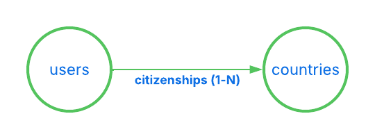

[](https://github.com/moonworm/jsonapi4j/actions/workflows/build.yml/badge.svg)
[](https://central.sonatype.com/artifact/pro.api4/jsonapi4j)
[](https://img.shields.io/github/last-commit/moonworm/jsonapi4j)
[](https://codecov.io/gh/moonworm/jsonapi4j)
[](https://github.com/moonworm/jsonapi4j/issues)
[](LICENSE)


# Introduction

Welcome to **JsonApi4j** — a lightweight API framework for Java for building [JSON:API](https://jsonapi.org/format/)-compliant APIs with minimal configuration.

There are some **application examples** available in [examples/](https://github.com/MoonWorm/jsonapi4j/tree/main/examples) folder. Please check them out for more insights on how to use the framework.

Detailed **documentation** is available [here](https://moonworm.github.io/jsonapi4j/).

# Quick start

Let's take a quick look at what a typical **JsonApi4j**-based application looks like in code.  
As an example, we'll integrate **JsonApi4j** into a clean or existing [Spring Boot](https://spring.io/projects/spring-boot) application.

## 1. Add Dependency

### Maven
```xml
<dependency>
  <groupId>pro.api4</groupId>
  <artifactId>jsonapi4j-rest-springboot</artifactId>
  <version>${jsonapi4j.version}</version>
</dependency>
```

### Gradle
```groovy
implementation "pro.api4:jsonapi4j-rest-springboot:${jsonapi4jVersion}"
```

The framework modules are published to Maven Central. You can find the latest available versions [here](https://mvnrepository.com/artifact/pro.api4).

## 2. Declare the Domain

Let's implement a simple application that exposes two resources - `users` and `countries` - and defines a relationship between them, representing which `citizenships` (or passports) each user holds.



Then, let's implement a few operations for these resources - reading multiple users and countries by their IDs, and retrieving which citizenships each user has.

## 3. Define the JSON:API Resource for Users

As mentioned above, let's start by defining our first JSON:API resource - `user` resource.

```java
@Component
public class UserResource implements Resource<UserDbEntity> {

    @Override
    public String resolveResourceId(UserDbEntity userDbEntity) {
      return userDbEntity.getId();
    }
  
    @Override
    public ResourceType resourceType() {
      return () -> "users";
    }
  
    @Override
    public UserAttributes resolveAttributes(UserDbEntity userDbEntity) {
      return new UserAttributes(
              userDbEntity.getFirstName() + " " + userDbEntity.getLastName(),
              userDbEntity.getEmail(),
              userDbEntity.getCreditCardNumber()
      );
    }
}
```

What's happening here:

* `String resourceId(UserDbEntity userDbEntity)` returns the unique identifier for this resource, must be unique across all resources of this type.
* `ResourceType resourceType()` defines a unique resource type name (`users` in this case). Each resource in your API must have a distinct type.
* `UserAttributes resolveAttributes(UserDbEntity userDbEntity)` - (optional) maps internal domain data (UserDbEntity) to the public API-facing representation (UserAttributes)

Each resource is parametrized with a type:
* `UserDbEntity` is how data is represented internally.

Here's a draft implementation of `UserAttributes`:

```java
public class UserAttributes {
    
    private final String firstName;
    private final String lastName;
    private final String email;
    private final String creditCardNumber;
    
    // constructors, getters and setters

}
```

and `UserDbEntity`:

```java
public class UserDbEntity {

    private final String id;
    private final String fullName;
    private final String email;
    private final String creditCardNumber;
    
    // constructors, getters and setters

}
```

Internal models (like `UserDbEntity` in this case) often differ from `UserAttributes`. They may encapsulate database-specific details (for example, a Hibernate entity or a JOOQ record), represent a DTO from an external service, or even aggregate data from multiple sources.

## 4. Declare the JSON:API Operation — Read Multiple Users

Now that we've defined our resource and attributes, let's implement the first operation to read all users.
This operation will be available under `GET /users`.

```java
@Component
public class ReadMultipleUsersOperation implements ReadMultipleResourcesOperation<UserDbEntity> {

    private final UserDb userDb;
    
    public ReadAllUsersOperation(UserDb userDb) {
        this.userDb = userDb;
    }

    @Override
    public ResourceType resourceType() {
        return () -> "users";
    }

    @Override
    public CursorPageableResponse<UserDbEntity> readPage(JsonApiRequest request) {
        UserDb.DbPage<UserDbEntity> pagedResult = userDb.readAllUsers(request.getCursor());
        return new CursorPageableResponse.fromItemsAndCursor(
                pagedResult.getEntities(),
                pagedResult.getCursor()
        );
    }

}
```

* `resourceType()` - identify which resource this operation belongs to (`users`).

* The `UserDb` class doesn't depend on any **JsonApi4j**-specific interfaces or components — it simply represents your data source.
  In a real application, this could be an ORM entity manager, a JOOQ repository, a REST client, or any other persistence mechanism.
  For the sake of this demo, here’s a simple in-memory implementation to support the operation above:

```java
@Component
public class UserDb {

    private Map<String, UserDbEntity> users = new ConcurrentHashMap<>();
    {
        users.put("1", new UserDbEntity("1", "John Doe", "john@doe.com", "123456789"));
        users.put("2", new UserDbEntity("2", "Jane Doe", "jane@doe.com", "222456789"));
        users.put("3", new UserDbEntity("3", "Jack Doe", "jack@doe.com", "333456789"));
        users.put("4", new UserDbEntity("4", "Jessy Doe", "jessy@doe.com", "444456789"));
        users.put("5", new UserDbEntity("5", "Jared Doe", "jared@doe.com", "555456789"));
    }

    public DbPage<UserDbEntity> readAllUsers(String cursor) {
        LimitOffsetToCursorAdapter adapter = new LimitOffsetToCursorAdapter(cursor).withDefaultLimit(2); // let's say our page size is 2
        LimitOffsetToCursorAdapter.LimitAndOffset limitAndOffset = adapter.decodeLimitAndOffset();

        int effectiveFrom = limitAndOffset.getOffset() < users.size() ? limitAndOffset.getOffset() : users.size() - 1;
        int effectiveTo = Math.min(effectiveFrom + limitAndOffset.getLimit(), users.size());

        List<UserDbEntity> result = new ArrayList<>(users.values()).subList(effectiveFrom, effectiveTo);
        String nextCursor = adapter.nextCursor(users.size());
        return new DbPage<>(nextCursor, result);
    }

    public static class DbPage<E> {

        private final String cursor;
        private final List<E> entities;

        public DbPage(String cursor, List<E> entities) {
            this.cursor = cursor;
            this.entities = entities;
        }

        public String getCursor() {
            return cursor;
        }

        public List<E> getEntities() {
            return entities;
        }
    }
}
```

You can now run your application (for example, on port `8080` by setting Spring Boot's property to `server.port=8080`) and send the next HTTP request: [/users?page[cursor]=DoJu](http://localhost:8080/jsonapi/users?page[cursor]=DoJu).

And then you should receive a paginated, JSON:API-compliant response such as:
```json
{
  "data": [
    {
      "attributes": {
        "fullName": "Jack Doe",
        "email": "jack@doe.com",
        "creditCardNumber": "333456789"
      },
      "links": {
        "self": "/users/3"
      },
      "id": "3",
      "type": "users"
    },
    {
      "attributes": {
        "fullName": "Jessy Doe",
        "email": "jessy@doe.com",
        "creditCardNumber": "444456789"
      },
      "links": {
        "self": "/users/4"
      },
      "id": "4",
      "type": "users"
    }
  ],
  "links": {
    "self": "/users?page%5Bcursor%5D=DoJu",
    "next": "/users?page%5Bcursor%5D=DoJw"
  }
}
```

Try to remove `page[cursor]=xxx` query parameter - it will just start reading user resources from the very beginning.

## 5. Define the JSON:API Resource for Countries

Similar to the `users` resource, we need to declare a dedicated JSON:API resource representing a `citizenship` - in this case, a resource of type `country`.

```java
@Component
public class CountryResource implements Resource<DownstreamCountry> {

    @Override
    public String resolveResourceId(DownstreamCountry downstreamCountry) {
        return downstreamCountry.getCca2(); // let's use CCA2 code as a unique country identifier
    }

    @Override
    public ResourceType resourceType() {
        return () -> "countries";
    }

    @Override
    public CountryAttributes map(DownstreamCountry downstreamCountry) {
        return new CountryAttributes(
                downstreamCountry.getName().getCommon(),
                downstreamCountry.getRegion()
        );
    }
  
}
```

This resource is parametrized with `DownstreamCountry`.

Here is draft implementation of `CountryAttributes`:

```java
public class CountryAttributes {
    
    private final String name;
    private final String region;
  
    // constructors, getters and setters

}
```

In this example, we expose only the `name` and `region` fields through the **attributes**, using `.getName().getCommon()` for the country name. While `cca2` is used as a country ID. 
And here is the draft implementation for `DownstreamCountry`:

```java
public class DownstreamCountry {

    private final String cca2;
    private final Name name;
    private final String region;
    
    // constructors, getters and setters

    public static class Name {
  
        private final String common;
        private final String official;

        // constructors, getters and setters
  
    }

}
```

## 6. Add a JSON:API Relationship - User Citizenships

Now that we've defined our first resources, let's establish a relationship between them.

We'll define a relationship called `citizenships` between the `UserJsonApiResource` and `CountryJsonApiResource`.
Each user can have multiple `citizenships`, which makes this a **to-many** relationship (represented by an array of resource identifier objects).

To implement this, we'll create a class that implements the ToManyRelationship interface:

```java
@Component
public class UserCitizenshipsRelationship implements ToManyRelationship<UserDbEntity, DownstreamCountry> {

    @Override
    public Relationship relationshipName() {
        return () -> "citizenships";
    }
  
    @Override
    public ResourceType parentResourceType() {
        return () -> "users";
    }
  
    @Override
    public ResourceType resolveResourceIdentifierType(DownstreamCountry downstreamCountry) {
        return () -> "countries";
    }
  
    @Override
    public String resolveResourceIdentifierId(DownstreamCountry downstreamCountry) {
        return downstreamCountry.getCca2();
    }

}
```

* `Relationship relationshipName()` -  defines the name of the relationship (`citizenships`).

* `ResourceType parentResourceType()` - identifies which resource this relationship belongs to (`users`).

* `ResourceType resolveResourceIdentifierType(DownstreamCountry downstreamCountry)` - determines the type of the related resource (`countries`). In some cases, a relationship may include multiple resource types - for example, a `userProperty` relationship could contain a mix of `cars`, `apartments`, or `yachts`.

* `String resolveResourceIdentifierId(DownstreamCountry downstreamCountry)` - resolves the unique identifier of each related resource (e.g., the country's CCA2 code).

## 7. Add the Missing Relationship Operation

The final piece of the puzzle is teaching the framework how to **resolve the declared relationship data**.

To do this, implement `ReadToManyRelationshipOperation<DownstreamCountry>` - this tells **JsonApi4j** how to find the related country resources (i.e., which passports or `citizenships` each user has).

```java
@Component
public class ReadUserCitizenshipsRelationshipOperation implements ReadToManyRelationshipOperation<DownstreamCountry> {

    private final RestCountriesFeignClient client;
    private final UserDb userDb;
    
    public ReadUserCitizenshipsRelationshipOperation(RestCountriesFeignClient client,
                                                     UserDb userDb) {
        this.client = client;
        this.userDb = userDb;
    }
    

    @Override
    public CursorAwareResponse<DownstreamCountry> read(JsonApiRequest request) {
        return CursorPageableResponse.fromItemsPageable(
                client.readCountriesByIds(userDb.getUserCitizenships(request.getResourceId())),
                request.getCursor(), 
                2 // set limit to 2
        );
    }

    @Override
    public RelationshipName relationshipName() {
        return () -> "citizenships";
    }

    @Override
    public ResourceType parentResourceType() {
        return () -> "users";
    }
    
}
```

* `relationshipName()` and `parentResourceType()` uniquely identify which resource and relationship this operation belongs to (`users` and `citizenships` accordingly).

* `RestCountriesFeignClient` could be a Feign client representing a third-party API - for example, the [restcountries](https://restcountries.com/) service.
  For simplicity, let's keep it local for now and simulate its behavior with an in-memory implementation:

```java
@Component
public class RestCountriesFeignClient {

  private static final Map<String, DownstreamCountry> COUNTRIES = Map.of(
          "NO", new DownstreamCountry("NO", new Name("Norway", "Kingdom of Norway"), "Europe"),
          "FI", new DownstreamCountry("FI", new Name("Finland", "Republic of Finland"), "Europe"),
          "US", new DownstreamCountry("US", new Name("United States", "United States of America"), "Americas")
  );

  public List<DownstreamCountry> readCountriesByIds(List<String> countryIds) {
      return countryIds.stream().filter(COUNTRIES::containsKey).map(COUNTRIES::get).toList();
  }

}
```

We also need to extend our existing `UserDb` to include information about which countries each user holds passports from (identified by their CCA2 codes).
```java

public class UserDb {
    
    //  ...
    
    private Map<String, List<String>> userIdToCountryCca2 = new ConcurrentHashMap<>();
    {
        userIdToCountryCca2.put("1", List.of("NO", "FI", "US"));
        userIdToCountryCca2.put("2", List.of("US"));
        userIdToCountryCca2.put("3", List.of("US", "FI"));
        userIdToCountryCca2.put("4", List.of("NO", "US"));
        userIdToCountryCca2.put("5", List.of("US"));
    }

    public List<String> getUserCitizenships(String userId) {
        return userIdToCountryCca2.get(userId);
    }

    // ...

}
```

Finally, this operation will be available under `GET /users/{userId}/relationships/citizenships`.

## 8. Enable Compound Documents (Optional)

To support [Compound Documents](https://jsonapi.org/format/#document-compound-documents), implement `ReadMultipleResourcesOperation<DownstreamCountry>` with an `id` filter. This allows the framework to resolve included resources efficiently when requested via the include query parameter.

While you could also implement `ReadByIdOperation<DownstreamCountry>`, this approach is less efficient because compound documents would be resolved sequentially, one by one, instead of using a single batch request via `filter[id]=x,y,z`.

```java
@Component
public class ReadMultipleCountriesOperation implements ReadMultipleResourcesOperation<DownstreamCountry> {

    private final RestCountriesFeignClient client;
    
    public ReadAllCountriesOperation(RestCountriesFeignClient client) {
        this.client = client;
    }

    @Override
    public ResourceType resourceType() {
        return () -> "countries";
    }

    @Override
    public CursorPageableResponse<DownstreamCountry> readPage(JsonApiRequest request) {
        if (request.getFilters().containsKey(ID_FILTER_NAME)) {
            return CursorPageableResponse.byItems(client.readCountriesByIds(request.getFilters().get(ID_FILTER_NAME)));
        } else {
            throw new JsonApi4jException(400, CommonCodes.MISSING_REQUIRED_PARAMETER, "Operation supports 'id' filter only");
        }
    }

}
```

* `resourceType()` - identify which resource this operation belongs to (`countries`).

* `readPage(JsonApiRequest request)` - delegates to the already implemented `readCountriesByIds(...)`. For now, this operation only supports requests using `filter[id]=x,y,z`. Support for **read all** or additional filters (e.g., by **region**) can be added later if needed.

This operation will be available under `GET /countries?filter[id]=x,y,z`.

Now we can finally start exploring some more exciting HTTP requests. Check out the next section for hands-on examples!

## 9. Request/Response Examples

### Fetch a User's Citizenship Relationships

Request: [/users/1/relationships/citizenships](http://localhost:8080/jsonapi/users/1/relationships/citizenships)

Response:
```json
{
  "data": [
    {
      "id": "NO",
      "type": "countries"
    },
    {
      "id": "FI",
      "type": "countries"
    }
  ],
  "links": {
    "self": "/users/1/relationships/citizenships",
    "related": {
      "countries": {
        "href": "/countries?filter[id]=FI,NO", 
        "describedby": "https://github.com/MoonWorm/jsonapi4j/tree/main/schemas/oas-schema-to-many-relationships-related-link.yaml", 
        "meta": {
          "ids": ["FI", "NO"]
        }
      }
    },
    "next": "/users/1/relationships/citizenships?page%5Bcursor%5D=DoJu"
  }
}
```

It's worth noting that each relationship has its own pagination. The link to the next page can be found in the response under `links` -> `next`.

For example, to fetch the second page of a user's citizenships relationship, try:
/citizenships?page[cursor]=DoJu](http://localhost:8080/jsonapi/users/1/relationships/citizenships?page%5Bcursor%5D=DoJu)

### Fetch a User's Citizenship Relationships Along with Corresponding Country Resources

Request: [/users/1/relationships/citizenships?include=citizenships](http://localhost:8080/jsonapi/users/1/relationships/citizenships?include=citizenships)

Response:

```json
{
  "data": [
    {
      "id": "NO",
      "type": "countries"
    },
    {
      "id": "FI",
      "type": "countries"
    }
  ],
  "links": {
    "self": "/users/1/relationships/citizenships?include=citizenships",
    "related": {
      "countries": {
        "href": "/countries?filter[id]=FI,NO",
        "describedby": "https://github.com/MoonWorm/jsonapi4j/tree/main/schemas/oas-schema-to-many-relationships-related-link.yaml",
        "meta": {
          "ids": ["FI", "NO"]
        }  
      }
    },
    "next": "/users/1/relationships/citizenships?include=citizenships&page%5Bcursor%5D=DoJu"
  },
  "included": [
    {
      "attributes": {
        "name": "Norway",
        "region": "Europe"
      },
      "links": {
        "self": "/countries/NO"
      },
      "id": "NO",
      "type": "countries"
    },
    {
      "attributes": {
        "name": "Finland",
        "region": "Europe"
      },
      "links": {
        "self": "/countries/FI"
      },
      "id": "FI",
      "type": "countries"
    }
  ]
}
```

### Fetch Multiple Countries by IDs

Request: [/countries?filter[id]=US,NO](http://localhost:8080/jsonapi/countries?filter[id]=US,NO)

Response:
```json
{
"data": [
    {
      "attributes": {
        "name": "Norway",
        "region": "Europe"
      },
      "links": {
        "self": "/countries/NO"
      },
      "id": "NO",
      "type": "countries"
    },
    {
      "attributes": {
        "name": "United States",
        "region": "Americas"
      },
      "links": {
        "self": "/countries/US"
      },
      "id": "US",
      "type": "countries"
    }
  ],
  "links": {
    "self": "/countries?filter%5Bid%5D=US%2CNO"
  }
}
```

### Fetch a Specific Page of Users with Citizenship Linkage Objects and Resolved Country Resources

Request: [/users?page[cursor]=DoJu&include=citizenships](http://localhost:8080/jsonapi/users?page[cursor]=DoJu&include=citizenships)

Response:
```json
{
  "data": [
    {
      "attributes": {
        "fullName": "Jack Doe",
        "email": "jack@doe.com"
      },
      "relationships": {
        "citizenships": {
          "data": [
            {
              "id": "US",
              "type": "countries"
            },
            {
              "id": "FI",
              "type": "countries"
            }
          ],
          "links": {
            "self": "/users/3/relationships/citizenships",
            "related": {
              "countries": {
                "href": "/countries?filter[id]=FI,US",
                "describedby": "https://github.com/MoonWorm/jsonapi4j/tree/main/schemas/oas-schema-to-many-relationships-related-link.yaml",
                "meta": {
                  "ids": ["FI", "US"]
                }
              }
            }
          }
        }
      },
      "links": {
        "self": "/users/3"
      },
      "id": "3",
      "type": "users"
    },
    {
      "attributes": {
        "fullName": "Jessy Doe",
        "email": "jessy@doe.com"
      },
      "relationships": {
        "citizenships": {
          "data": [
            {
              "id": "NO",
              "type": "countries"
            },
            {
              "id": "US",
              "type": "countries"
            }
          ],
          "links": {
            "self": "/users/4/relationships/citizenships",
            "related": {
              "countries": {
                "href": "/countries?filter[id]=NO,US",
                "describedby": "https://github.com/MoonWorm/jsonapi4j/tree/main/schemas/oas-schema-to-many-relationships-related-link.yaml",
                "meta": {
                  "ids": ["NO", "US"]
                }
              }
            }
          }
        }
      },
      "links": {
        "self": "/users/4"
      },
      "id": "4",
      "type": "users"
    }
  ],
  "links": {
    "self": "/users?include=citizenships&page%5Bcursor%5D=DoJu",
    "next": "/users?include=citizenships&page%5Bcursor%5D=DoJw"
  },
  "included": [
    {
      "attributes": {
        "name": "Norway",
        "region": "Europe"
      },
      "links": {
        "self": "/countries/NO"
      },
      "id": "NO",
      "type": "countries"
    },
    {
      "attributes": {
        "name": "Finland",
        "region": "Europe"
      },
      "links": {
        "self": "/countries/FI"
      },
      "id": "FI",
      "type": "countries"
    },
    {
      "attributes": {
        "name": "United States",
        "region": "Americas"
      },
      "links": {
        "self": "/countries/US"
      },
      "id": "US",
      "type": "countries"
    }
  ]
}
```

# Contributing 

I welcome issues and pull requests! See [CONTRIBUTING.md](./CONTRIBUTING.md) for details.

# License 

This project is licensed under the Apache 2.0 License - see the [LICENSE](LICENSE) file for details.