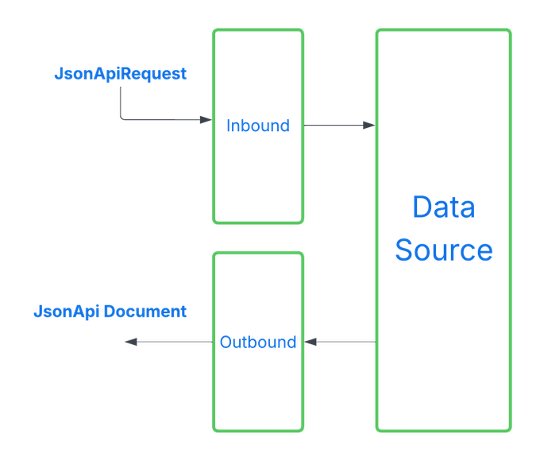

### Overview

The Access Control Plugin is a plugin that enforces security rules during JSON:API request processing without altering the core execution flow.
It evaluates access requirements at well-defined stages of the request lifecycle and conditionally allows, anonymizes, or short-circuits parts of the request or response based on the resolved principal context.

In order to enable JsonApi4j Access Control Plugin (AC) - add the next dependency:

```xml
<dependency>
  <groupId>pro.api4</groupId>
  <artifactId>jsonapi4j-ac-plugin</artifactId>
  <version>${jsonapi4j.version}</version>
</dependency>
```

If you're using JsonApi4j in the scope of Spring Boot or Quarkus App - everything will be autoconfigured using default values.

Access control is applied in two phases:
* Inbound evaluation – before any data is fetched. Rules are evaluated against the incoming `JsonApiRequest`. If access is denied, downstream execution is skipped and the response is safely anonymized.
* Outbound evaluation – after data has been fetched and the JSON:API document has been composed. Rules are evaluated per resource and relationship element, allowing fine-grained control over visibility of attributes, meta, links, and relationship identifiers.

The plugin derives its rules from `@AccessControl` annotations placed on operations, resources, relationships, attributes, or individual fields.
During execution, it traverses JSON:API structures using explicit visitor points and applies access decisions consistently across resource objects and resource identifier objects.

This design enables declarative, centralized security policies while keeping domain logic and request handling clean, predictable, and specification-compliant.

### Evaluation stages

As it was mentioned above access control evaluation is performed twice during the request lifecycle - during the **inbound** and **outbound** stages.



#### Inbound Evaluation Stage

During the **inbound** stage, the **JsonApi4j** application has received a request but has not yet fetched any data from downstream sources.
Access control rules are evaluated against the `JsonApiRequest` since no other data is available at this point.
If access control requirements are not met, data fetching is skipped, and the `data` field in the response will be fully anonymized.

Inbound access control requirements can be defined on an operations level by placing `@AccessControl` annotation on top of the class declaration. When implementing `ResourceOperations<RESOURCE_DTO>`, `ToOneRelationshipOperations<RESOURCE_DTO, RELATIONSHIP_DTO>` or `ToManyRelationshipOperations<RESOURCE_DTO, RELATIONSHIP_DTO>` interfaces `@AccessControl` annotation must be placed above the corresponding method.

#### Outbound Evaluation Stage

The **outbound** stage occurs after data has been fetched from the data source, the response document has been composed, and right before it is sent to the client.
At this point, access control rules are evaluated for each [JSON:API Resource Object](https://jsonapi.org/format/#document-resource-objects) or [Resource Identifier Object](https://jsonapi.org/format/#document-resource-identifier-objects) within the generated JSON:API document.

##### Resource Documents

Resource documents typically contain full [JSON:API Resource Objects](https://jsonapi.org/format/#document-resource-objects).

Access control requirements can be defined for:
* Entire Resource Object - if requirements are not met, the whole resource is anonymized. `@AccessControl` annotation must be placed on top of the class that implements `Resource<RESOURCE_DTO>` interface.
* Specific members (e.g., `attributes`, `links`, `meta`) - if requirements are not met, only those members are anonymized. `@AccessControl` annotation must be placed above the `resolveAttributes(...)`, `resolveResourceLinks(...)` or other methods accordingly.
* Individual `attribute` fields - if requirements are not met, only the affected fields are anonymized. `@AccessControl` annotation must be placed for the needed field.

##### Relationship Documents

Relationship documents contain only [Resource Identifier Objects](https://jsonapi.org/format/#document-resource-identifier-objects).
Access control rules can be defined for:
* Entire **Resource Identifier Object** - if requirements are not met, the entire resource identifier will be anonymized. `@AccessControl` annotation must be placed on top of the class that implements `ToOneRelationship<RELATIONSHIP_DTO>` or `ToManyRelationship<RELATIONSHIP_DTO>` interface.
* Specific members (e.g., `meta`) - if requirements are not met, only those members will be anonymized. `@AccessControl` annotation must be placed above the `resolveResourceIdentifierMeta(...)` method.

### Access Control Requirements

By default, **JsonApi4j** does not enforce any access control (i.e., all requests are allowed).
However, you can configure and enforce access control rules for either or both stages - inbound and outbound - depending on your security and data exposure requirements.

There are four types of access control requirements, which can be combined in any way as needed:
* **Authentication requirement** - verifies whether the request is made on behalf of an authenticated client or user. This can be used to restrict anonymous access.
* **Access tier requirement** - verifies whether the client or user belongs to a specific access tier or group. The recommended default set of tiers includes: Root Admin, Admin, Partner, Internal, and Public. This structure helps organize access policies by predefined privilege levels. You don't need to use all tiers - just rely on the ones that fit your needs. It's also possible to define a custom set of access tiers. See more details below.
* **OAuth2 scope(s) requirement** - verifies whether the request was authorized to access user data protected by certain OAuth2 scopes. This information is typically embedded within the JWT access token.
* **Ownership requirement** - ensures that the requested resource belongs to the client or user making the request. This is typically used for APIs where users are only allowed to view their own data, but not others'.

If any of the specified requirements are not met, the corresponding section - or the entire object - will be anonymized.

### Setting Principal Context

By default, the plugin uses the `DefaultPrincipalResolver`, which relies on the following HTTP headers to resolve the current authentication context:

1. `X-Authenticated-User-Id` - identifies whether the request is sent on behalf of an authenticated client or user. Considered authenticated if the value is not null or blank. Also used for ownership checks.
2. `X-Authenticated-Client-Access-Tier` - defines the principal's access tier. By default, the framework supports the following values: **NO_ACCESS**, **PUBLIC**, **PARTNER**, **ADMIN**, and **ROOT_ADMIN**. Custom tiers can be registered by implementing the `AccessTierRegistry` interface.
3. `X-Authenticated-User-Granted-Scopes` - specifies the OAuth2 scopes granted to the client by the user. This should be a space-separated string.

You can also implement a custom `PrincipalResolver` to define how the framework retrieves principal-related information from incoming HTTP requests.

The resolved principal context is then used by the framework during both **inbound** and **outbound** access control evaluations.

### Setting Access Requirements

How and where should you declare your access control requirements?

There is one annotation that defines all access control requirement in one place - `@AccessControl`.
It encapsulates rules for all currently supported dimensions: `authenticated`, `scopes`, `tier`, and `ownership`. Just populate you requirements there.

Please review the list of examples down below to getter a better grasp how and where to declare your access requirements.

### Examples

#### Example 1: Inbound Access Control

Let's allow new user creation only for authenticated clients with the `ADMIN` access tier.

In this case, we'll use the `@AccessControl` annotation to enforce the access rule at the operation level.

```java
public class UserOperations implements ResourceOperations<UserDbEntity> {

    @AccessControl(
            authenticated = Authenticated.AUTHENTICATED,
            tier = @AccessControlAccessTier(ADMIN_ACCESS_TIER)
    )
    @Override
    public UserDbEntity create(JsonApiRequest request) {
        // ...
    }

}
```

#### Example 2: Outbound Access Control for Attributes Object

First, let's limit access to a personal data for all non-authorized users.
Secondly, let's hide the user's credit card number from everyone except the owner. To achieve this, we need place the `@AccessControl` annotation on top of the class declaration and on the `creditCardNumber` field.
Notes:
1. `authenticated = Authenticated.AUTHENTICATED` - requires the framework to check whether the client that initiated this request is authenticated.
2. `@AccessControlScopes(requiredScopes = {"users.sensitive.read"})` - forces the framework to check if client initiated this request has got permissions from the resource owner to access their sensitive data.
3. `@AccessControlOwnership(ownerIdFieldPath = "id")` - tells the framework that the owner id is located in the `id` field of the JSON:API Resource Object. That is true because we deal with users and user id represents who own this data.

```java
@AccessControl(authenticated = Authenticated.AUTHENTICATED)
public class UserAttributes {

    private final String firstName;
    private final String lastName;
    private final String email;

    @AccessControl(
            authenticated = Authenticated.AUTHENTICATED,
            scopes = @AccessControlScopes(requiredScopes = {"users.sensitive.read"}),
            tier = @AccessControlAccessTier(TierAdmin.ADMIN_ACCESS_TIER),
            ownership = @AccessControlOwnership(ownerIdFieldPath = "id")
    )
    private final String creditCardNumber;

    // ...

}
```

#### Example 3: Outbound Access Control for Resource Object

Now, let's showcase how to hide some sections on the Resource Object level. Since we don't have a dedicated class for it, we need to use our `Resource` declaration class for it.

Here is the list of available places where you can place `@AccessControl` annotation:
1. On top of the Resource declaration - in order to control access to the entire JSON:API Resource Object
2. For `Resource#resolveAttributes(...)` method to control access just for resource `attributes` section. As it was already shown above an alternative option is also to place `@AccessControl` on top of the attributes custom class.
3. For `Resource#resolveResourceLinks(...)` method to control access just for resource `links` section.
4. For `Resource#resolveResourceMeta(...)` method to control access just for resource `meta` section.

In the example below we've configured our entire `UserResource` in a way it's visible only for authenticated users while its `meta` section is only visible for clients with **ADMIN** access tier:

```java
@AccessControl(authenticated = Authenticated.AUTHENTICATED)
public class UserResource implements Resource<UserDbEntity> {

  @AccessControl(tier = @AccessControlAccessTier(TierAdmin.ADMIN_ACCESS_TIER))
  @Override
  public Object resolveResourceMeta(JsonApiRequest request, UserDbEntity dataSourceDto) {
      // ...
  }

}
```

#### Example 4: Outbound Access Control for Resource Identifier Object

The last example will show how to hide some sections on the Resource Identifier Object level. This object is used for all relationship operations in a response document instead of well known Resource Object. Since we don't have a dedicated class for it, we need to use our Relationship declaration class for it.

Here is the list of available places where you can place `@AccessControl` annotation:
1. On top of the `Relationship` declaration - in order to control access to the entire JSON:API Resource Identifier Object
2. For `Relationship#resolveResourceIdentifierMeta(...)` method to control access just for resource identifier `meta` section.

In the example below we've configured our entire `UserCitizenshipsRelationship` in a way this relationship is visible only for authenticated users that have been granted 'users.citizenships.read' scope for a client. Moreover, `ownership` setting requires a user to be an owner; thus, this information is only visible for a user it belongs to. And finally, lets expose its `meta` section for clients with **ADMIN** access tier only:

```java
@AccessControl(
        authenticated = Authenticated.AUTHENTICATED,
        scopes = @AccessControlScopes(requiredScopes = {"users.citizenships.read"}),
        ownership = @AccessControlOwnership(ownerIdExtractor = ResourceIdFromUrlPathExtractor.class)
)
public class UserCitizenshipsRelationship implements ToManyRelationship<DownstreamCountry> {

  @AccessControl(tier = @AccessControlAccessTier(TierAdmin.ADMIN_ACCESS_TIER))
  @Override
  public Object resolveResourceIdentifierMeta(JsonApiRequest relationshipRequest,
                                              DownstreamCountry downstreamCountry) {
    // ...
  }

}
```

#### Notes
1. If you're using `@AccessControl` annotation please note that `ownership` setting is different for **inbound** and **outbound** stages. If you want to configure these rules for the **inbound** stage - please use `AccessControlOwnership#ownerIdExtractor` property that allows you to tell the framework how to extract the owner id from the incoming request. For the **outbound** stage - use `AccessControlOwnership#ownerIdFieldPath` to point the framework to the field in the response that holds the owner id value.
2. If you're working with `jsonapi4j-core` module you can place `@AccessControl` annotation on either a custom `ResourceObject`, or an `Attributes` object and their fields for the **outbound** evaluations. For the **inbound** evaluations the annotation can be also placed on the class-level of the `Request` class.

**Available properties**

| Property name          | Default value | Description                            |
|------------------------|---------------|----------------------------------------|
| `jsonapi4j.ac.enabled` | `true`          | Enables/Disables Access Control plugin |
