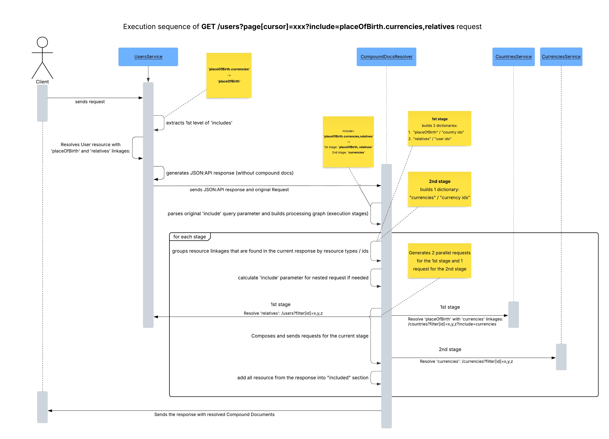

### Overview

[Compound Documents](https://jsonapi.org/format/#document-compound-documents) is a core feature of the JSON:API specification that enable clients to include related resources within a single request.
For example, when fetching users, you can ask the server to include each user's related `citizenships` by calling:
`GET /users?page[cursor]=xxx&include=citizenships`.
Only relationships explicitly exposed through your resource definitions can be included.
All resolved related resources are placed in the top-level `included` array.

### Multiple and Nested Includes

You can request multiple relationships in a single call using commas - e.g. `include=relatives,placeOfBirth`.

JSON:API defines that relationship endpoints themselves (`/users/1/relationships/...`) return only linkage objects (type + id), not the related resources.
If you also want to include the full related resources, use the `include` parameter: `GET /users/1/relationships/placeOfBirth?include=placeOfBirth`.

Compound documents also support multi-level includes, allowing chained relationships such as `include=placeOfBirth.currencies`.
Each level in the chain must represent a valid relationship on the corresponding resource.
For instance, this example first resolves each user's `placeOfBirth` (a Country resource), and then resolves each country's `currencies`.

The same applies to relationship endpoints - e.g. a relationship request may include nested relationships that start from the relationship name itself, f.e. `/users/{id}/relationships/relatives?include=relatives.relatives` will resolve user's relatives and relatives of his relatives in one go.

### Resolution Process

The Compound Documents Resolver operates as a post-processor: it inspects the original response and, if necessary, enriches it with the `included` section.

**JsonApi4j** resolves includes in stages.
For example, `/users/{id}?include=relatives,placeOfBirth.currencies,placeOfBirth.economy` is parsed into:
* **Stage 1**: resolve list of `relatives` and a country that is a `placeOfBirth` for the requested user
* **Stage 2**: resolve `currencies` and `economy` for a country resolved in Stage 1

Within each stage, resources are grouped by type and their IDs; then, parallel batch requests (e.g. using `filter[id]=1,2,3,4,5`) are made for each resource type.
If a bulk operation isn't implemented, the framework falls back to sequential "read-by-id" calls.
That's why it's important to implement either "filter[id]" or "read-by-id" operations giving the priority to the first one.

Since each additional level may trigger new batches of requests, it's important to use this feature judiciously.
You can control and limit the depth and breadth of includes using the `CompoundDocsProperties` configuration - for example, the `maxHops` property defines the maximum allowed relationship depth.

### Deployment & Configuration

The Compound Documents Resolver is provided by a separate module: `jsonapi4j-compound-docs-resolver`.
By default, this feature is disabled on the application server.
To enable it, set: `jsonapi4j.compound-docs.enabled=true`.

Because it's a standalone module, you can host this logic either:
* within your application server, or
* at an **API Gateway** level (for example, for centralized response composition).

**Available properties**

| Property name                         | Default value                        | Description                                                                                                                                                                       |
|---------------------------------------|--------------------------------------|-----------------------------------------------------------------------------------------------------------------------------------------------------------------------------------|
| `jsonapi4j.cd.enabled`                | `false`                              | Enables/disables Compound Documents post-processing.                                                                                                                              |
| `jsonapi4j.cd.maxHops`                | `2`                                  | Max include traversal depth for compound document resolution.                                                                                                                     |
| `jsonapi4j.cd.maxIncludedResources`   | `100`                                | Maximum amount of included resources. Doesn't guarantee the exact gap - can be more if fact. Checks before moving to down to the next depth level and adds all resolved resource. |
| `jsonapi4j.cd.errorStrategy`          | `IGNORE`                             | Error handling strategy in compound docs resolver. Available options: `IGNORE`, `FAIL`                                                                                            |
| `jsonapi4j.cd.propagation`            | `FIELDS,CUSTOM_QUERY_PARAMS,HEADERS` | List of request parts that must be propagated during Compound Docs resolution loop. Available options: `FIELDS`, `CUSTOM_QUERY_PARAMS`, `HEADERS`                                 |
| `jsonapi4j.cd.deduplicateResources`   | `true`                               | Defines if Compound Docs plugin should deduplicate resources in the 'included' section (by 'type' / 'id')                                                                         |
| `jsonapi4j.cd.httpConnectTimeoutMs`   | `5000`                               | Controls how long to wait when establishing TCP connection (in millisecond). Applied to each generated HTTP request.                                                              |
| `jsonapi4j.cd.httpTotalTimeoutMs`     | `10000`                              | Controls total request timeout (in millisecond). Applied to each generated HTTP request.                                                                                                                                 |
| `jsonapi4j.cd.mapping.<resourceType>` | empty map                            | Per-resource-type base URL mapping used by compound docs resolver.                                                                                                                |

### Caching

Since JSON:API defines a clear way to uniquely identify resources using the "type" + "id" pair, a cache layer can be integrated to store resolved resources and avoid redundant downstream requests.

The Compound Documents Resolver includes a built-in in-memory cache that stores individual resources keyed by type, id, requested includes, and sparse fieldsets.
Cache entries respect `Cache-Control` headers from downstream HTTP responses: the `max-age` (or `s-maxage`) directive determines TTL, while `no-store`, `no-cache`, and `private` directives prevent caching entirely.

When a compound document request arrives, the resolver checks the cache for each required resource.
Only cache misses trigger downstream HTTP calls. Cached and freshly fetched resources are merged transparently.

The final compound document response carries an aggregated `Cache-Control` header reflecting the most restrictive directive across all included resources.
For example, if `countries` returns `max-age=300` and `currencies` returns `max-age=60`, the compound document response will contain `max-age=60`.

**Cache configuration**

| Property name                | Default value | Description                                                                 |
|------------------------------|---------------|-----------------------------------------------------------------------------|
| `jsonapi4j.cd.cache.enabled` | `true`        | Enables/disables the built-in resource cache for compound docs resolution.  |
| `jsonapi4j.cd.cache.maxSize` | `1000`        | Soft maximum number of cached entries. Eviction uses LRU + TTL expiration.  |

The built-in cache uses a `ConcurrentHashMap` with lazy expiration and LRU eviction when the soft capacity is exceeded.
For distributed deployments or custom eviction policies, implement the `CompoundDocsResourceCache` SPI and register your own bean - the framework will use it instead of the default in-memory cache.

**Cache-Control propagation for primary resources**

To propagate downstream cache settings from your primary resource operations upstream, use: `CacheControlPropagator#propagateCacheControl(String cacheSettings)`.
This method forwards cache headers so that the Compound Documents Resolver can aggregate them with the included resources' directives.

### Sequence Overview

Here's a high-level sequence diagram for the Compound Documents resolution process:

