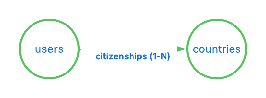
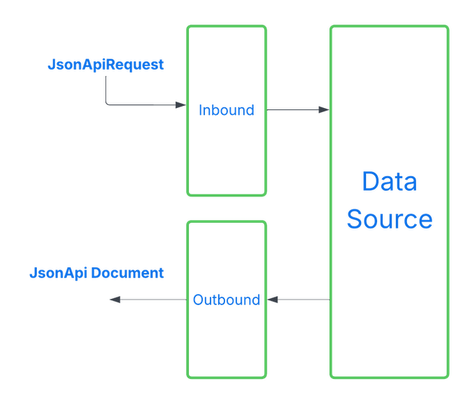

# JsonApi4j Documentation

## Introduction

**JsonApi4j** is a modern, lightweight Java framework for building well-structured, scalable, and production-ready RESTful APIs.  
It streamlines the API design and development process by enforcing a consistent data format, eliminating repetitive boilerplate, and providing clear extension points for advanced use cases.

Unlike generic REST frameworks, **JsonApi4j** is purpose-built around the [JSON:API specification](https://jsonapi.org), which promotes best practices and addresses common pain points in designing and maintaining mature APIs.  

This approach helps **organizations** drastically simplify API governance at scale.

By abstracting the repetitive parts of RESTful design, **JsonApi4j** enables **developers** to focus on business logic instead of API plumbing.

## Why JsonApi4j?

The following features and design principles will help you determine whether **JsonApi4j** fits your use case.

### Organizational & Business Motivation

Modern systems often consist of multiple services that need to expose and consume consistent data structures.  
**JsonApi4j** helps achieve this by:

- 🧩 Implements the [JSON:API specification](https://jsonapi.org), providing a predictable, efficient, and scalable data exchange format - eliminating the need for custom, company-wide API guidelines.
- 📘 Generates [OpenAPI specifications](https://swagger.io/specification/) out of the box, enabling clear and transparent API documentation across the organization.

### Engineering Motivation

Whether you're standardizing your organization's API layer or building a new service from scratch, **JsonApi4j** provides a strong foundation for creating robust, performant, and secure APIs.

- ⚙️ **Framework Agnostic.** Works with all modern Java web frameworks - including [Spring Boot](https://spring.io/projects/spring-boot), [Quarkus](https://quarkus.io/), and [JAX-RS](https://www.oracle.com/technical-resources/articles/java/jax-rs.html).  
  The HTTP layer is built on top of the [Jakarta Servlet API](https://jakarta.ee/specifications/servlet/), the foundation for all Java web applications.

- 🔄 **JSON:API-compliant request and response processing.** Includes automatic error handling fully aligned with the JSON:API specification.

- 🔐 **Flexible authentication and authorization model.** Supports fine-grained access control, including per-field data anonymization based on access tier, user scopes, and resource ownership.

- 🚀 **Parallel and concurrent execution.** The framework parallelizes every operation that can safely run concurrently - from relationship resolution to compound document processing - and supports advanced concurrency optimizations, including virtual threads.

- 📦 **Compound Documents.** Supports multi-level `include` queries (for example, `include=comments.authors.followers`) for complex, client-driven requests.  
  The compound document resolver is available as a standalone, embeddable module that can also run at the API Gateway level, using a shared resource cache to reduce latency and improve performance.

- 🔌 **Pluggable architecture.** Designed for extensibility with rich customization capabilities and support for user-defined plugins.

- 🧠 **Declarative approach with minimal boilerplate.** Simply define your domain models (resources and relationships), supported operations, and authorization rules - the framework handles the rest.

## Sample Apps

Example applications are available in the [examples](https://github.com/MoonWorm/jsonapi4j/tree/main/examples) directory — check them out for practical guidance on using the framework.

## Getting Started

Let's take a quick look at what a typical **JsonApi4j**-based service looks like in code.  
As an example, we'll integrate **JsonApi4j** into a clean or existing [Spring Boot](https://spring.io/projects/spring-boot) application. 

### 1. Add Dependency

#### Maven
```xml
<dependency>
  <groupId>pro.api4</groupId>
  <artifactId>jsonapi4j-rest-springboot</artifactId>
  <version>${jsonapi4j.version}</version>
</dependency>
```

#### Gradle
```groovy
implementation "pro.api4:jsonapi4j-rest-springboot:${jsonapi4jVersion}"
```

The framework modules are published to Maven Central. You can find the latest available versions [here](https://mvnrepository.com/artifact/pro.api4).

### 2. Declare the Domain

Let's implement a simple application that exposes two resources - `users` and `countries` - and defines a relationship between them, representing which `citizenships` (or passports) each user holds.



Then, let's implement a few operations for these resources - reading multiple users and countries by their IDs, and retrieving which citizenships each user has. 

### 3. Define the JSON:API Resource for Users

As mentioned above, let's start by defining our first JSON:API resource - `user` resource.

```java
@Component
public class UserResource implements Resource<UserAttributes, UserDbEntity> {

    @Override
    public String resolveResourceId(UserDbEntity userDbEntity) {
      return userDbEntity.getId();
    }
  
    @Override
    public ResourceType resourceType() {
      return () -> "users";
    }
  
    @Override
    public UserAttributes resolveAttributes(UserDbEntity userDbEntity) {
      return new UserAttributes(
              userDbEntity.getFirstName() + " " + userDbEntity.getLastName(),
              userDbEntity.getEmail(),
              userDbEntity.getCreditCardNumber()
      );
    }
}
```

What's happening here:

* `String resourceId(UserDbEntity userDbEntity)` returns the unique identifier for this resource, must be unique across all resources of this type.
* `ResourceType resourceType()` defines a unique resource type name (`users` in this case). Each resource in your API must have a distinct type.
* `UserAttributes resolveAttributes(UserDbEntity userDbEntity)` - (optional) maps internal domain data (UserDbEntity) to the public API-facing representation (UserAttributes)

Each resource is parametrized with two types: 

* `UserAttributes` is what is exposed via API, and 
* `UserDbEntity` is how data is represented internally.

Here's a draft implementation of both classes:

```java
public class UserAttributes {
    
    private final String firstName;
    private final String lastName;
    private final String email;
    private final String creditCardNumber;
    
    // constructors, getters and setters

}
```

```java
public class UserDbEntity {

    private final String id;
    private final String fullName;
    private final String email;
    private final String creditCardNumber;
    
    // constructors, getters and setters

}
```

Internal models (like `UserDbEntity` in this case) often differ from `UserAttributes`. They may encapsulate database-specific details (for example, a Hibernate entity or a JOOQ record), represent a DTO from an external service, or even aggregate data from multiple sources.

### 4. Declare the JSON:API Operation — Read Multiple Users

Now that we've defined our resource and attributes, let's implement the first operation to read all users.
This operation will be available under `GET /users`.

```java
@Component
public class ReadMultipleUsersOperation implements ReadMultipleResourcesOperation<UserDbEntity> {

    private final UserDb userDb;
    
    public ReadAllUsersOperation(UserDb userDb) {
        this.userDb = userDb;
    }

    @Override
    public ResourceType resourceType() {
        return () -> "users";
    }

    @Override
    public CursorPageableResponse<UserDbEntity> readPage(JsonApiRequest request) {
        UserDb.DbPage<UserDbEntity> pagedResult = userDb.readAllUsers(request.getCursor());
        return new CursorPageableResponse.fromItemsAndCursor(
                pagedResult.getEntities(),
                pagedResult.getCursor()
        );
    }

}
```

* `resourceType()` - identify which resource this operation belongs to (`users`).

* The `UserDb` class doesn't depend on any **JsonApi4j**-specific interfaces or components — it simply represents your data source.
In a real application, this could be an ORM entity manager, a JOOQ repository, a REST client, or any other persistence mechanism.
For the sake of this demo, here’s a simple in-memory implementation to support the operation above:

```java
@Component
public class UserDb {

    private Map<String, UserDbEntity> users = new ConcurrentHashMap<>();
    {
        users.put("1", new UserDbEntity("1", "John Doe", "john@doe.com", "123456789"));
        users.put("2", new UserDbEntity("2", "Jane Doe", "jane@doe.com", "222456789"));
        users.put("3", new UserDbEntity("3", "Jack Doe", "jack@doe.com", "333456789"));
        users.put("4", new UserDbEntity("4", "Jessy Doe", "jessy@doe.com", "444456789"));
        users.put("5", new UserDbEntity("5", "Jared Doe", "jared@doe.com", "555456789"));
    }

    public DbPage<UserDbEntity> readAllUsers(String cursor) {
        LimitOffsetToCursorAdapter adapter = new LimitOffsetToCursorAdapter(cursor).withDefaultLimit(2); // let's say our page size is 2
        LimitOffsetToCursorAdapter.LimitAndOffset limitAndOffset = adapter.decodeLimitAndOffset();

        int effectiveFrom = limitAndOffset.getOffset() < users.size() ? limitAndOffset.getOffset() : users.size() - 1;
        int effectiveTo = Math.min(effectiveFrom + limitAndOffset.getLimit(), users.size());

        List<UserDbEntity> result = new ArrayList<>(users.values()).subList(effectiveFrom, effectiveTo);
        String nextCursor = adapter.nextCursor(users.size());
        return new DbPage<>(nextCursor, result);
    }

    public static class DbPage<E> {

        private final String cursor;
        private final List<E> entities;

        public DbPage(String cursor, List<E> entities) {
            this.cursor = cursor;
            this.entities = entities;
        }

        public String getCursor() {
            return cursor;
        }

        public List<E> getEntities() {
            return entities;
        }
    }
}
```

You can now run your application (for example, on port `8080` by setting Spring Boot's property to `server.port=8080`) and send the next HTTP request: [/users?page[cursor]=DoJu](http://localhost:8080/jsonapi/users?page[cursor]=DoJu).

And then you should receive a paginated, JSON:API-compliant response such as:
```json
{
  "data": [
    {
      "attributes": {
        "fullName": "Jack Doe",
        "email": "jack@doe.com",
        "creditCardNumber": "333456789"
      },
      "links": {
        "self": "/users/3"
      },
      "id": "3",
      "type": "users"
    },
    {
      "attributes": {
        "fullName": "Jessy Doe",
        "email": "jessy@doe.com",
        "creditCardNumber": "444456789"
      },
      "links": {
        "self": "/users/4"
      },
      "id": "4",
      "type": "users"
    }
  ],
  "links": {
    "self": "/users?page%5Bcursor%5D=DoJu",
    "next": "/users?page%5Bcursor%5D=DoJw"
  }
}
```

Try to remove `page[cursor]=xxx` query parameter - it will just start reading user resources from the very beginning.

### 5. Define the JSON:API Resource for Countries

Similar to the `users` resource, we need to declare a dedicated JSON:API resource representing a `citizenship` - in this case, a resource of type `country`.

```java
@Component
public class CountryResource implements Resource<CountryAttributes, DownstreamCountry> {

    @Override
    public String resolveResourceId(DownstreamCountry downstreamCountry) {
        return downstreamCountry.getCca2(); // let's use CCA2 errorCode as a unique country identifier
    }

    @Override
    public ResourceType resourceType() {
        return () -> "countries";
    }

    @Override
    public CountryAttributes map(DownstreamCountry downstreamCountry) {
        return new CountryAttributes(
                downstreamCountry.getName().getCommon(),
                downstreamCountry.getRegion()
        );
    }
  
}
```

This resource is parametrized with two types: `CountryAttributes` and `DownstreamCountry`.

```java
public class CountryAttributes {
    
    private final String name;
    private final String region;
  
    // constructors, getters and setters

}
```

In this example, we expose only the `name` and `region` fields through the **attributes**, using `.getName().getCommon()` for the country name. While `cca2` is used as a country ID. 

```java
public class DownstreamCountry {

    private final String cca2;
    private final Name name;
    private final String region;
    
    // constructors, getters and setters

    public static class Name {
  
        private final String common;
        private final String official;

        // constructors, getters and setters
  
    }

}
```

### 6. Add a JSON:API Relationship - User Citizenships

Now that we've defined our first resources, let's establish a relationship between them.

We'll define a relationship called `citizenships` between the `UserJsonApiResource` and `CountryJsonApiResource`.
Each user can have multiple `citizenships`, which makes this a **to-many** relationship (represented by an array of resource identifier objects).

To implement this, we'll create a class that implements the ToManyRelationship interface:

```java
@Component
public class UserCitizenshipsRelationship implements ToManyRelationship<UserDbEntity, DownstreamCountry> {

    @Override
    public Relationship relationshipName() {
        return () -> "citizenships";
    }
  
    @Override
    public ResourceType parentResourceType() {
        return () -> "users";
    }
  
    @Override
    public ResourceType resolveResourceIdentifierType(DownstreamCountry downstreamCountry) {
        return () -> "countries";
    }
  
    @Override
    public String resolveResourceIdentifierId(DownstreamCountry downstreamCountry) {
        return downstreamCountry.getCca2();
    }

}
```

* `Relationship relationshipName()` -  defines the name of the relationship (`citizenships`).

* `ResourceType parentResourceType()` - identifies which resource this relationship belongs to (`users`).

* `ResourceType resolveResourceIdentifierType(DownstreamCountry downstreamCountry)` - determines the type of the related resource (`countries`). In some cases, a relationship may include multiple resource types - for example, a `userProperty` relationship could contain a mix of `cars`, `apartments`, or `yachts`.

* `String resolveResourceIdentifierId(DownstreamCountry downstreamCountry)` - resolves the unique identifier of each related resource (e.g., the country's CCA2 code).

### 7. Add the Missing Relationship Operation

The final piece of the puzzle is teaching the framework how to **resolve the declared relationship data**.  

To do this, implement `ReadToManyRelationshipOperation<DownstreamCountry>` - this tells **JsonApi4j** how to find the related country resources (i.e., which passports or `citizenships` each user has).

```java
@Component
public class ReadUserCitizenshipsRelationshipOperation implements ReadToManyRelationshipOperation<DownstreamCountry> {

    private final RestCountriesFeignClient client;
    private final UserDb userDb;
    
    public ReadUserCitizenshipsRelationshipOperation(RestCountriesFeignClient client,
                                                     UserDb userDb) {
        this.client = client;
        this.userDb = userDb;
    }
    

    @Override
    public CursorAwareResponse<DownstreamCountry> read(JsonApiRequest request) {
        return CursorPageableResponse.fromItemsPageable(
                client.readCountriesByIds(userDb.getUserCitizenships(request.getResourceId())),
                request.getCursor(), 
                2 // set limit to 2
        );
    }

    @Override
    public RelationshipName relationshipName() {
        return () -> "citizenships";
    }

    @Override
    public ResourceType parentResourceType() {
        return () -> "users";
    }
    
}
```

* `relationshipName()` and `parentResourceType()` uniquely identify which resource and relationship this operation belongs to (`users` and `citizenships` accordingly).

* `RestCountriesFeignClient` could be a Feign client representing a third-party API - for example, the [restcountries](https://restcountries.com/) service.
For simplicity, let's keep it local for now and simulate its behavior with an in-memory implementation:

```java
@Component
public class RestCountriesFeignClient {

  private static final Map<String, DownstreamCountry> COUNTRIES = Map.of(
          "NO", new DownstreamCountry("NO", new Name("Norway", "Kingdom of Norway"), "Europe"),
          "FI", new DownstreamCountry("FI", new Name("Finland", "Republic of Finland"), "Europe"),
          "US", new DownstreamCountry("US", new Name("United States", "United States of America"), "Americas")
  );

  public List<DownstreamCountry> readCountriesByIds(List<String> countryIds) {
    return countryIds.stream().map(COUNTRIES::get).toList();
  }

}
```

We also need to extend our existing `UserDb` to include information about which countries each user holds passports from (identified by their CCA2 codes).
```java

public class UserDb {
    
    //  ...
    
    private Map<String, List<String>> userIdToCountryCca2 = new ConcurrentHashMap<>();
    {
        userIdToCountryCca2.put("1", List.of("NO", "FI", "US"));
        userIdToCountryCca2.put("2", List.of("US"));
        userIdToCountryCca2.put("3", List.of("US", "FI"));
        userIdToCountryCca2.put("4", List.of("NO", "US"));
        userIdToCountryCca2.put("5", List.of("US"));
    }

    public List<String> getUserCitizenships(String userId) {
        return userIdToCountryCca2.get(userId);
    }

    // ...

}
```

Finally, this operation will be available under `GET /users/{userId}/relationships/citizenships`.

### 8. Enable Compound Documents (Optional)

To support [Compound Documents](https://jsonapi.org/format/#document-compound-documents), implement `ReadMultipleResourcesOperation<DownstreamCountry>` with an `id` filter. This allows the framework to resolve included resources efficiently when requested via the include query parameter.

While you could also implement `ReadByIdOperation<DownstreamCountry>`, this approach is less efficient because compound documents would be resolved sequentially, one by one, instead of using a single batch request via `filter[id]=x,y,z`.

```java
@Component
public class ReadMultipleCountriesOperation implements ReadMultipleResourcesOperation<DownstreamCountry> {

    private final RestCountriesFeignClient client;
    
    public ReadAllCountriesOperation(RestCountriesFeignClient client) {
        this.client = client;
    }

    @Override
    public ResourceType resourceType() {
        return () -> "countries";
    }

    @Override
    public CursorPageableResponse<DownstreamCountry> readPage(JsonApiRequest request) {
        if (request.getFilters().containsKey(ID_FILTER_NAME)) {
            return CursorPageableResponse.byItems(client.readCountriesByIds(request.getFilters().get(ID_FILTER_NAME)));
        } else {
            throw new JsonApi4jException(400, CommonCodes.MISSING_REQUIRED_PARAMETER, "Operation supports 'id' filter only");
        }
    }

}
```

* `resourceType()` - identify which resource this operation belongs to (`countries`).

* `readPage(JsonApiRequest request)` - delegates to the already implemented `readCountriesByIds(...)`. For now, this operation only supports requests using `filter[id]=x,y,z`. Support for **read all** or additional filters (e.g., by **region**) can be added later if needed.  

This operation will be available under `GET /countries?filter[id]=x,y,z`.

Now we can finally start exploring some more exciting HTTP requests. Check out the next section for hands-on examples!

### 9. Request/Response Examples

#### Fetch a User's Citizenship Relationships

Request: [/users/1/relationships/citizenships](http://localhost:8080/jsonapi/users/1/relationships/citizenships)

Response:
```json
{
  "data": [
    {
      "id": "NO",
      "type": "countries"
    },
    {
      "id": "FI",
      "type": "countries"
    }
  ],
  "links": {
    "self": "/users/1/relationships/citizenships",
    "related": {
      "countries": {
        "href": "/countries?filter[id]=FI,NO", 
        "describedby": "https://github.com/MoonWorm/jsonapi4j/tree/main/schemas/oas-schema-to-many-relationships-related-link.yaml", 
        "meta": {
          "ids": ["FI", "NO"]
        }
      }
    },
    "next": "/users/1/relationships/citizenships?page%5Bcursor%5D=DoJu"
  }
}
```

It's worth noting that each relationship has its own pagination. The link to the next page can be found in the response under `links` -> `next`.

For example, to fetch the second page of a user's citizenships relationship, try:
/citizenships?page[cursor]=DoJu](http://localhost:8080/jsonapi/users/1/relationships/citizenships?page%5Bcursor%5D=DoJu)

#### Fetch a User's Citizenship Relationships Along with Corresponding Country Resources

Request: [/users/1/relationships/citizenships?include=citizenships](http://localhost:8080/jsonapi/users/1/relationships/citizenships?include=citizenships)

Response:

```json
{
  "data": [
    {
      "id": "NO",
      "type": "countries"
    },
    {
      "id": "FI",
      "type": "countries"
    }
  ],
  "links": {
    "self": "/users/1/relationships/citizenships?include=citizenships",
    "related": {
      "countries": {
        "href": "/countries?filter[id]=FI,NO",
        "describedby": "https://github.com/MoonWorm/jsonapi4j/tree/main/schemas/oas-schema-to-many-relationships-related-link.yaml",
        "meta": {
          "ids": ["FI", "NO"]
        }  
      }
    },
    "next": "/users/1/relationships/citizenships?include=citizenships&page%5Bcursor%5D=DoJu"
  },
  "included": [
    {
      "attributes": {
        "name": "Norway",
        "region": "Europe"
      },
      "links": {
        "self": "/countries/NO"
      },
      "id": "NO",
      "type": "countries"
    },
    {
      "attributes": {
        "name": "Finland",
        "region": "Europe"
      },
      "links": {
        "self": "/countries/FI"
      },
      "id": "FI",
      "type": "countries"
    }
  ]
}
```

#### Fetch Multiple Countries by IDs

Request: [/countries?filter[id]=US,NO](http://localhost:8080/jsonapi/countries?filter[id]=US,NO)

Response:
```json
{
"data": [
    {
      "attributes": {
        "name": "Norway",
        "region": "Europe"
      },
      "links": {
        "self": "/countries/NO"
      },
      "id": "NO",
      "type": "countries"
    },
    {
      "attributes": {
        "name": "United States",
        "region": "Americas"
      },
      "links": {
        "self": "/countries/US"
      },
      "id": "US",
      "type": "countries"
    }
  ],
  "links": {
    "self": "/countries?filter%5Bid%5D=US%2CNO"
  }
}
```

#### Fetch a Specific Page of Users with Citizenship Linkage Objects and Resolved Country Resources

Request: [/users?page[cursor]=DoJu&include=citizenships](http://localhost:8080/jsonapi/users?page[cursor]=DoJu&include=citizenships)

Response:
```json
{
  "data": [
    {
      "attributes": {
        "fullName": "Jack Doe",
        "email": "jack@doe.com"
      },
      "relationships": {
        "citizenships": {
          "data": [
            {
              "id": "US",
              "type": "countries"
            },
            {
              "id": "FI",
              "type": "countries"
            }
          ],
          "links": {
            "self": "/users/3/relationships/citizenships",
            "related": {
              "countries": {
                "href": "/countries?filter[id]=FI,US",
                "describedby": "https://github.com/MoonWorm/jsonapi4j/tree/main/schemas/oas-schema-to-many-relationships-related-link.yaml",
                "meta": {
                  "ids": ["FI", "US"]
                }
              }
            }
          }
        }
      },
      "links": {
        "self": "/users/3"
      },
      "id": "3",
      "type": "users"
    },
    {
      "attributes": {
        "fullName": "Jessy Doe",
        "email": "jessy@doe.com"
      },
      "relationships": {
        "citizenships": {
          "data": [
            {
              "id": "NO",
              "type": "countries"
            },
            {
              "id": "US",
              "type": "countries"
            }
          ],
          "links": {
            "self": "/users/4/relationships/citizenships",
            "related": {
              "countries": {
                "href": "/countries?filter[id]=NO,US",
                "describedby": "https://github.com/MoonWorm/jsonapi4j/tree/main/schemas/oas-schema-to-many-relationships-related-link.yaml",
                "meta": {
                  "ids": ["NO", "US"]
                }
              }
            }
          }
        }
      },
      "links": {
        "self": "/users/4"
      },
      "id": "4",
      "type": "users"
    }
  ],
  "links": {
    "self": "/users?include=citizenships&page%5Bcursor%5D=DoJu",
    "next": "/users?include=citizenships&page%5Bcursor%5D=DoJw"
  },
  "included": [
    {
      "attributes": {
        "name": "Norway",
        "region": "Europe"
      },
      "links": {
        "self": "/countries/NO"
      },
      "id": "NO",
      "type": "countries"
    },
    {
      "attributes": {
        "name": "Finland",
        "region": "Europe"
      },
      "links": {
        "self": "/countries/FI"
      },
      "id": "FI",
      "type": "countries"
    },
    {
      "attributes": {
        "name": "United States",
        "region": "Americas"
      },
      "links": {
        "self": "/countries/US"
      },
      "id": "US",
      "type": "countries"
    }
  ]
}
```

## Framework internals

### Project structure

**JsonApi4j** is designed to be **modular and embeddable**, allowing you to use only the parts you need depending on your application context.
Each module is published as a separate artifact in Maven Central.

- 🌀 [jsonapi4j-core](https://github.com/MoonWorm/jsonapi4j/tree/main/jsonapi4j-core) — a lightweight JSON:API request processor, ideal for embedding into non-web services (e.g., CLI tools) that need to handle JSON:API input/output without bringing in HTTP-related dependencies.
- 🔌 [jsonapi4j-rest](https://github.com/MoonWorm/jsonapi4j/tree/main/jsonapi4j-rest) — the Servlet API–based HTTP layer for integration with any Java web framework. Can be used directly in plain Servlet applications or as a foundation for building native integrations for frameworks like Spring Boot, Quarkus, etc.
- 🌱 [jsonapi4j-rest-springboot](https://github.com/MoonWorm/jsonapi4j/tree/main/jsonapi4j-rest-springboot) — [Spring Boot](https://spring.io/projects/spring-boot) auto-configuration module that integrates **JsonApi4j** seamlessly into a Spring environment.
- 🌐 [jsonapi4j-compound-docs-resolver](https://github.com/MoonWorm/jsonapi4j/tree/main/jsonapi4j-compound-docs-resolver) — a standalone **compound documents resolver** that automatically fetches and populates the `included` section of JSON:API responses. Perfect for API Gateway-level use or microservice response composition layers.

Here's how transitive dependencies between modules are structured in the framework:

```text
jsonapi4j-core
│
├── jsonapi4j-compound-docs-resolver
│
└── jsonapi4j-rest
    ├── depends on → jsonapi4j-core
    └── depends on → jsonapi4j-compound-docs-resolver
        │
        └── jsonapi4j-rest-springboot
            └── depends on → jsonapi4j-rest
```

In short - if you're integrating **JsonApi4j** with a Spring Boot application, you only need to include a single dependency:
`jsonapi4j-rest-springboot`.

### Designing the Domain

As highlighted earlier in the **Getting Started** guide, designing your domain model is one of the most important steps - and typically the first one - when building APIs with **JsonApi4j**. A well-structured domain design ensures clear resource boundaries, consistent data representation, and smoother integration with the JSON:API specification.

There are a few extension points that are important to understand when working with **JsonApi4j**.
In most cases, you'll simply implement one or more predefined interfaces that allow the framework to recognize and apply your domain configuration automatically.

All domain-related interfaces are located in the `jsonapi4j-core` module under the `pro.api4.jsonapi4j.domain` package.

Here are the most essential ones:

* `Resource<ATTRIBUTES, RESOURCE_DTO>` - implement this interface to declare a new **JSON:API resource**
* `ToOneRelationship<RESOURCE_DTO, RELATIONSHIP_DTO>` - implement this interface to declare a new **JSON:API to-one relationship**
* `ToManyRelationship<RESOURCE_DTO, RELATIONSHIP_DTO>` - implement this interface to declare a new **JSON:API to-many relationship**

#### Resource<ATTRIBUTES, RESOURCE_DTO>

This is the primary interface for defining a JSON:API resource. It describes how your internal model is going to be represented by JSON:API documents. 

Think about resources as of vertices (or nodes) in a graph.

Type parameters:
* `ATTRIBUTES` - the class representing the resource's exposed **attributes** in the API (`UserAttributes`, `CountryAttributes`, etc.).
* `RESOURCE_DTO` - the internal data object or DTO from your domain or persistence layer (`UserDbEntity`, `DownstreamCountry`, etc.).

Mandatory / Key Responsibilities:
* Provide a unique resource ID. Implement `resolveResourceId(RESOURCE_DTO dataSourceDto)`). This is mandatory for every resource and ensures each object can be uniquely identified.
* Define the resource type. Implement `resolveResourceId()`). This is mandatory to differentiate resource types across your APIs.
* Map internal objects to API-facing attributes. Implement `resolveAttributes(RESOURCE_DTO dataSourceDto)`). By default, **attributes** are `null`, but most resources should define this as it represents the core domain information.  

Optional / Advanced Capabilities:
* Top-level **links** for single resource documents. Implement `resolveTopLevelLinksForSingleResourceDoc(JsonApiRequest request, RESOURCE_DTO dataSourceDto)`). By default, generates "self" member only.
* Top-level **links** for multi-resource documents. Implement `resolveTopLevelLinksForMultiResourcesDoc(JsonApiRequest request, List<RESOURCE_DTO> dataSourceDtos, String nextCursor)`). By default, generates "self" and "next" members if applicable.
* Top-level **meta** for single resource documents. Implement `resolveTopLevelMetaForSingleResourceDoc(JsonApiRequest request, RESOURCE_DTO dataSourceDto)`. By default, generates `null`.
* Top-level **meta** for multi-resource documents. Implement `resolveTopLevelMetaForMultiResourcesDoc(JsonApiRequest request, List<RESOURCE_DTO> dataSourceDtos)`. By default, generates `null`.
* Resource-level **links**. Implement `resolveResourceLinks(JsonApiRequest request, RESOURCE_DTO dataSourceDto)`. By default, generates a "self" link.
* Resource-level **meta**. Implement `resolveResourceMeta(JsonApiRequest request, RESOURCE_DTO dataSourceDto)`). By default, generates `null`.

#### ToOneRelationship<RESOURCE_DTO, RELATIONSHIP_DTO>

This interface is used to define a **To-One relationship** between a JSON:API resource and another related resource. It allows the framework to map and expose single-valued relationships in a JSON:API-compliant response.

Think of this relationship as a 1-to-1 edge in a graph, where one parent resource can reference a single related resource.

Type parameters:
* `RESOURCE_DTO` - the internal data object or DTO representing the parent resource (e.g., `UserDbEntity`).
* `RELATIONSHIP_DTO` - the internal data object or DTO representing the related resource (e.g., `DownstreamCountry`).

Mandatory / Key Responsibilities:
* Define the relationship name. Implement `relationshipName()`. This identifies the relationship field in the JSON:API document.
* Specify the parent resource type. Implement `parentResourceType()`. This tells the framework which resource the relationship belongs to.
* Resolve the related resource type. Implement `resolveResourceIdentifierType(RELATIONSHIP_DTO relationshipDto)`. This defines the type of the related resource in the JSON:API document.
* Resolve the related resource ID. Implement `resolveResourceIdentifierId(RELATIONSHIP_DTO relationshipDto)`. This should return a unique identifier for the related resource.

Optional / Advanced Capabilities:
* Customize relationship links. Implement `resolveRelationshipLinks(JsonApiRequest request, RESOURCE_DTO resourceDto, RELATIONSHIP_DTO relationshipDto)`. By default, generates "self" and "related" links for the relationship.
* Customize relationship meta. Implement `resolveRelationshipMeta(JsonApiRequest request, RESOURCE_DTO resourceDto, RELATIONSHIP_DTO relationshipDto)`. By default, generates `null`.

Notes:
* A To-One relationship always resolves to a single resource identifier object (or `null`) in the JSON:API response.
* Multiple relationships can be defined for the same resource by implementing multiple `ToOneRelationship` instances.

#### ToManyRelationship<RESOURCE_DTO, RELATIONSHIP_DTO>

This interface is used to define a **To-Many relationship** between a JSON:API resource and another related resource. It allows the framework to map and expose multivalued relationships in a JSON:API-compliant response.

Think of this relationship as a 1-to-N edge in a graph, where one parent resource can reference multiple related resources.

Refer to the **ToOneRelationship** section for additional details, as the key concepts and advanced capabilities are largely the same.

### Implementing Operations

Operations focus on retrieving internal models, which are then converted into JSON:API-compliant responses. Operations that modify data accept JSON:API-compliant payloads and update the internal data accordingly. 

The JSON:API specification defines a limited set of standard operations. Some variations with JSON:API specification are acceptable, but the framework selects the one that makes the most sense for a given context. 

All operation interfaces are located in the `jsonapi4j-core` module under the `pro.api4.jsonapi4j.operation` package.

By default, all **JsonApi4j** operations are exposed under the `/jsonapi` root path. This prevents conflicts when integrating JSON:API endpoints into an existing application that may have other REST endpoints. To change the root path, simply set the `jsonapi4j.root-path` property.

Here is the list of available operations: 

Resource-related operations:
* `ReadResourceByIdOperation<RESOURCE_DTO>` - available under `GET /{resource-type}/{resource-id}`, supports compound documents JSON:API feature
  * `RESOURCE_DTO readById(JsonApiRequest request)` - reads a single internal object representing a JSON:API resource of the specified type.
* `ReadMultipleResourcesOperation<RESOURCE_DTO>` - available under `GET /{resource-type}`, supports compound documents, filtering, and ordering JSON:API features 
  * `CursorPageableResponse<RESOURCE_DTO> readPage(JsonApiRequest request)` - reads multiple internal objects representing JSON:API resources of the specified type. 
* `CreateResourceOperation<RESOURCE_DTO>` - available under `POST /{resource-type}`, accepts valid JSON:API Document as a payload. 
  * `RESOURCE_DTO create(JsonApiRequest request)` - creates a single object in the backend system and returns its internal representation. 
* `UpdateResourceOperation` - available under `PATCH /{resource-type}/{resource-id}`, accepts valid JSON:API Document as a payload.
  * `void update(JsonApiRequest request)` - updates a single object in the backend system.
* `DeleteResourceOperation` - available under `DELETE /{resource-type}/{resource-id}`.
  * `void delete(JsonApiRequest request)` - deletes a single object in the backend system.

Relationship-related operations:
* `ReadToOneRelationshipOperation<RESOURCE_DTO, RELATIONSHIP_DTO>` - available under `GET /{resource-type}/{resource-id}/relationships/{relationship-name}`, supports compound documents JSON:API feature
  * `read(JsonApiRequest relationshipRequest)` - reads a single internal object representing a JSON:API resource identifier for the given to-one resource relationship.
  * `readForResource(JsonApiRequest relationshipRequest, RESOURCE_DTO resourceDto)` - optional. Resolves an internal relationship's object directly from the parent resource's internal object if it's possible. This avoids an external request. Used when the `include` query parameter is specified for any resource-related read operation. 
* `ReadToManyRelationshipOperation<RESOURCE_DTO, RELATIONSHIP_DTO>` - available under `GET /{resource-type}/{resource-id}/relationships/{relationship-name}`, supports compound documents, filtering, and ordering JSON:API features
  * `CursorPageableResponse<RELATIONSHIP_DTO> read(JsonApiRequest relationshipRequest)` - similar to `ReadToOneRelationshipOperation` but returns a pageable collection of objects.
  * `CursorPageableResponse<RELATIONSHIP_DTO> readForResource(JsonApiRequest relationshipRequest, RESOURCE_DTO resourceDto)` - similar to `ReadToOneRelationshipOperation` but returns a pageable collection of objects.
* `UpdateToOneRelationshipOperation` - available under `PATCH /{resource-type}/{resource-id}/relationships/{relationship-name}`, accepts valid JSON:API Document as a payload.
  * `void update(JsonApiRequest request)` - updates or deletes a single resource linkage representing a To-One JSON:API relationship in the backend. 
* `UpdateToManyRelationshipOperation` - available under `PATCH /{resource-type}/{resource-id}/relationships/{relationship-name}`, accepts valid JSON:API Document as a payload.
  * `void update(JsonApiRequest request)` - updates or deletes all resource linkages representing a To-Many JSON:API relationship in the backend.

Validation. 
* Every operation has an optional `validate(JsonApiRequest request)` method sometimes with a default generic implementation. It is recommended to place all input validation logic here, keeping the main business logic in the corresponding operation method. 
  * If a resource is not found in the backend system, throw `ResourceNotFoundException` or use `throwResourceNotFoundException(...)` method. This will generate a JSON:API compliant error response.
  * For other scenarios, throw `JsonApi4jException` and specify `httpStatus`, `errorCode`, and `detail`. This will generate a JSON:API compliant error response.
  * See **Register custom error handlers** chapter for additional ways to handle errors, for example, integration with custom validation frameworks.

### Access Control

#### Evaluation stages

Access control evaluation is executed twice for request lifecycle - for **inbound** and **outbound** stage.



During the **inbound** stage JsonApi4j application just received a request, but hasn't triggered data fetching from a downstream data source. Access control rules are evaluated for `JsonApiRequest` since there no other data available yet.
If access control requirements are not met there will be no any further data fetching stages and **data** field will be fully anonymized.

**Outbound** stage is executed after gathering data from a data source, composing response document, and right before sending it to the client. Access control rules are evaluated for each resource/resource identifier withing a generated JSON:API Document. Resource documents usually contain full [JSON:API Resource Objects](https://jsonapi.org/format/#document-resource-objects) while Relationship documents consist of [Resource Identifier Objects](https://jsonapi.org/format/#document-resource-identifier-objects) only.
In case of **Resource Documents** access control requirements can be set for either:
- Entire JSON:API Resource. If access control requirements are not met - entire resource will be anonymized.
- Any member of the JSON:API Resource (e.g. 'attributes', 'meta'). If access control requirements are not met - only this particular field will be anonymized.
- Entire 'attributes' member of the JSON:API Resource. If access control requirements are not met - entire 'attributes' section will be anonymized.
- Any member of the 'attributes' abject. If access control requirements are not met - only this particular field will be anonymized.
- Any relationship. If access control requirements are not met for the relationship - relationship data fetching process will not be triggered and the relationship data will be anonymized.

In case of **Relationship Documents** access control requirements can be set for either:
- Entire JSON:API Resource Identifier object. If access control requirements are not met - entire resource identifier will be anonymized.
- Any member of the JSON:API Resource Identifier (e.g. 'meta'). If access control requirements are not met - only this particular field will be anonymized.

By default, JsonApi4j allows everything (no Access Control evaluations), but it's always possible to enforce rules for either both or just one of these stage.

#### Access Control Requirements

There are four requirements that can be assigned in any combination:
- **Authentication requirement** - checks if request is sent on behalf of authenticated client/user. Can be used to restrict anonymous access.
- **Access tier requirement** - checks whether the client/user that originated the request belongs to a particular group e.g. 'Admin', 'Internal API consumers', 'Public API consumers'. This helps to organize access to your APIs based on so-called tiers.
- **OAuth2 Scope(s) requirement** - checks if request was authorised to access user data protected by a certain OAuth2 scope(s). Usually, this information is carried within JWT Access Token.
- **Ownership requirement** - checks if requested resource belongs to a client/user that triggered this request. This is used for those APIs where user can view only its own data, but not others data.

If any of specified requirements are not met - the marked section or the entire object will be anonymized.

#### Setting Principal Context

By default, the framework uses `DefaultPrincipalResolver` which relies on the next HTTP headers in order to resolve the current auth context:

1. `X-Authenticated-User-Id` - to check if request is sent on behalf of authenticated client/user, considers as true if not null/blank. Is also used for ownership checks.
2. `X-Authenticated-Client-Access-Tier` - for principal's Access Tier. By default, supports the next values: 'NO_ACCESS', 'PUBLIC', 'PARTNER', 'ADMIN', 'ROOT_ADMIN'. It's possible to declare your own tiers by implementing `AccessTierRegistry`.
3. `X-Authenticated-User-Granted-Scopes` - for getting OAuth2 Scopes which user has granted the client, space-separated string

It is also possible to implement your own `PrincipalResolver` that tells the framework how to retrieve Principal-related info from an incoming HTTP request.

Later, the framework will use this info for Inbound/Outbound evaluations.

#### Setting Access Requirements

How and where to declare your Access Control requirements?

There are two main approaches:
1. Via Java annotations. If you are working with **jsonapi4j-core** it's possible to place Access Control annotations on either a custom `ResourceObject`, or a custom `Attributes` object. Annotations can be placed both on class and field levels. If you're working with modules that operates higher abstractions - **jsonapi4j-rest** or **jsonapi4j-rest-springboot** - you can place annotations only for an Attributes Object. Here is the list of annotations that can be used: `@AccessControlAuthenticated`, `@AccessControlScopes`, `@AccessControlAccessTier`, `@AccessControlOwnership`. This approach is preferable for setting Access Control requirements for Attributes.
2. Via **JsonApi4j** plugin system. You can use `OperationInboundAccessControlPlugin` plugin for your Operations - that will be used for the Inbound Access Control evaluations. `ResourceOutboundAccessControlPlugin` can be used for the `Resource` implementations and be applied for JSON:API Resource Objects during the Outbound Access Control evaluations. `RelationshipsOutboundAccessControlPlugin` can be used for the `Relationship` implementations and be applied for JSON:API Resource Identifier Objects during the Outbound Access Control evaluations. This is approach is preferable for all other cases.

If the system detects a mix of settings it merges them giving priority to ones that were set programmatically via Plugins.

#### Examples

Example 1: Outbound Access Control

Let's hide user's credit card number for everyone but the owner. By achieving that `@AccessControlOwnership(ownerIdFieldPath = "id")` must be placed on top of `creditCardNumber` field.
We can also put `@AccessControlAuthenticated` to ensure the user is authenticated and `@AccessControlScopes(requiredScopes = {"users.sensitive.read"})` if we want to protect access to this field by checking whether the client has gotten a user grant for this data.

```java
public class UserAttributes {
    
    private final String firstName;
    private final String lastName;
    private final String email;
    
    @AccessControlAuthenticated
    @AccessControlScopes(requiredScopes = {"users.sensitive.read"})
    @AccessControlOwnership(ownerIdFieldPath = "id")
    private final String creditCardNumber;
    
    // constructors, getters and setters

}
```

Example 2: Inbound Access Control

Let's only allow a new user creation for the admin clients.

```java
@Component
public class CreateUserOperation implements CreateResourcesOperation<UserDbEntity> {

    // methods implementations

    @Override
    public List<OperationPlugin<?>> plugins() {
      return List.of(
        OperationInboundAccessControlPlugin.builder()
          .requestAccessControl(
            AccessControlRequirements.builder()
              .requiredAccessTier(
                AccessControlAccessTierModel.builder()
                  .requiredAccessTier(TierAdmin.ADMIN_ACCESS_TIER)
                  .build()
              )
              .build()
          )
          .build()
      );
    }

}
```

### OpenAPI Specification

Since JSON:API has predetermined list of operations and schemas Open API Spec generation can be fully automated.

JsonApi4j can generate an instance of `io.swagger.v3.oas.models.OpenApi` model and then expose it either through a Maven Exec Plugin or via dedicated endpoint.

Here is two ways of how to generate an Open API Specification for you APIs:

1. Access via HTTP endpoint. By default, you can access either JSON or YAML version of the Open API Specification by accessing [/jsonapi/oas](http://localhost:8080/jsonapi/oas) endpoint. It supports 'format' query parameter that can be either 'json' or 'yaml'. Always fallbacks to JSON format.
2. Via Maven Exec Plugin. TBD

By default, JsonApi4j generate all schemas and operations for you. But if you need to enrich it with more data e.g. 'info', 'components' -> 'securitySchemes' or custom HTTP headers you need to explicitly configure that in `JsonApi4jProperties` ('oas' section) via `application.yaml` if you're using 'jsonapi4j-rest-springboot' or via proper `JsonApi4jServletContainerInitializer` bootstrapping if you're relying on Servlet API only from 'jsonapi4j-rest'.

### Compound documents

[Compound Documents](https://jsonapi.org/format/#document-compound-documents) is a part of JSON:API specification that describes the way to include related resources in one request. For example, if you want to request some 'users' you can also ask the server to include related resources to these users. It's worth mentioning that you can only ask for those resources that enabled via relationships. All resolved resourced are placed as a flat structure into a top-level "included" field. In order to request related resources "include" query parameter must be used, for example `/users?page[cursor]=xxx&include=citizenships`.

It is allowed to request multiple relationships in one go - just specify relationship names using comma ',' as a separator, for example `include=citizenships,placeOfBirth`

Compound Documents feature also supports multi-level relationship resolution. That means that client can request a chain of relationships, f.e. `include=placeOfBirth.currency`. The relationships sequence is a dot-separated string that must be a valid chain of relationships - meaning they must exist for the resources on each stage. This particular example would trigger the process that resolves related resources in two stages - firstly, JsonApi4j will resolve 'placeOfBirth' relationship which is represented by Country resource. Then, as a second stage, the framework will resolve 'currency' of the previously resolved countries. 'currency' relationship must exist for Country resource.

Since every level generates a new wave of requests it's important to remember that and use these feature carefully. JsonApi4j relies on batch operations (e.g. `filter[id]=1,2,3,4,5`) that's why it's important to implement this operation for all resources that can be requested as someone's relationship. If the operation is not implemented the framework tries to fallback on sequential 'read by id' operation if it exists.

Let's define what does resolution stage means in terms of how framework resolves Compound Documents. For example, `include=citizenships,placeOfBirth.currency` would be parsed into two stages - first stage includes 'citizenships' and 'placeOfBirth' relationships. The second stage includes 'currency' relationship. Within each stage the framework groups all related resources by their types and associated list of identifiers and sends as many parallel request as many resource types were detected.

In order to be able to control the amount of these extra requests the framework provides some settings and guardrails to control the limits. Refer `CompoundDocsProperties` for more details, for example `maxHops` settings allows to define how many levels your system supposed to support.

Compound Documents resolver is part of a dedicated module 'jsonapi4j-compound-docs-resolver'. By default, this feature is disabled on the application server, but it can be enabled by setting `enabled` property to `true`. Since the logic is part of a separate independent module it opens multiple options where to host this logic. There are at least two the most obvious options: on the same application server or on the API Gateway level.

- Compound docs works as a post processor. First main request is executed.
- Sequence diagram - stages
- Point the difference in 'includes' for Primary Resources and Relationship requests (how relationship request refers self).
- CacheControlPropagator examples, how to configure an external Cache that relies on HTTP Cache Control headers

### Register custom error handlers
- Example of how to declare a custom error handler
- Examples for JsonApi4jException and ResourceNotFoundException, throwResourceNotFoundException - IN OPERATIONS

### Performance tunings

- batch read relationship operations
- custom executor service, 
- jsonApi4j properties, e.g. maxHops

## JSON:API Specification deviations

1. JsonApi4j encourages flat resource structure e.g. '/users' and '/articles' instead of '/users/{userId}/articles'. This approach fully automates default 'links' generation and enables the gates for automatic Compound Documents resolution.
2. No support for [Sparse Fieldsets](https://jsonapi.org/format/#fetching-sparse-fieldsets) (maybe later)
3. No support for [client generated ids](https://jsonapi.org/format/#document-resource-object-identification) ('lid') -> use 'id' field and set client-generated id there.
4. JSON:API spec is agnostic about the pagination strategy (e.g. 'page[number]' and 'page[size]' for limit-offset), while the framework encourages Cursor pagination ('page[cursor]')
5. Doesn't support JSON:API Profiles and Extensions (maybe later)
6. Default relationships concept, no 'relationships'->'{relName}'->'data' resolution by default. This is done to have more control under extra +N requests per each existing relationship
7. The framework enforces the requirement for implementing either 'Filter By Id' ('/users?filter[id]=123') operation or 'Read By Id' ('/users/123') operation because Compound Docs Resolver uses them to compose 'included' section.
