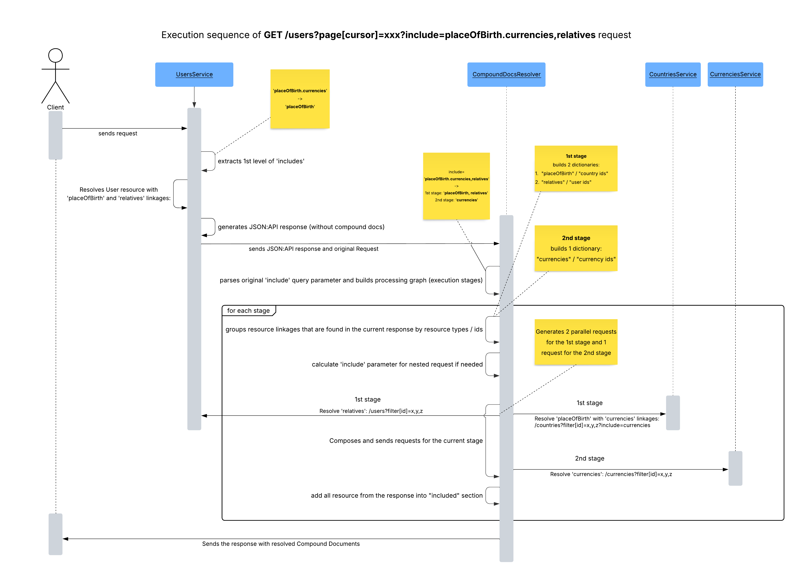

# JsonApi4j Documentation

## Introduction

**JsonApi4j** is a modern, lightweight Java framework for building well-structured, scalable, and production-ready RESTful APIs.  
It streamlines the API design and development process by enforcing a consistent data format, eliminating repetitive boilerplate, and providing clear extension points for advanced use cases.

Unlike generic REST frameworks, **JsonApi4j** is purpose-built around the [JSON:API specification](https://jsonapi.org), which promotes best practices and addresses common pain points in designing and maintaining mature APIs.  

This approach helps **organizations** drastically simplify API governance at scale.

By abstracting the repetitive parts of RESTful design, **JsonApi4j** enables **developers** to focus on business logic instead of API plumbing.

## Why JsonApi4j?

The following features and design principles will help you determine whether **JsonApi4j** fits your use case.

### Organizational & Business Motivation

Modern systems often consist of multiple services that need to expose and consume consistent data structures.  
**JsonApi4j** helps achieve this by:

- 🧩 Implements the [JSON:API specification](https://jsonapi.org), providing a predictable, efficient, and scalable data exchange format - eliminating the need for custom, company-wide API guidelines.
- 📘 Generates [OpenAPI specifications](https://swagger.io/specification/) out of the box, enabling clear and transparent API documentation across the organization.

### Engineering Motivation

Whether you're standardizing your organization's API layer or building a new service from scratch, **JsonApi4j** provides a strong foundation for creating robust, performant, and secure APIs.

- ⚙️ **Framework Agnostic.** Works with all modern Java web frameworks - including [Spring Boot](https://spring.io/projects/spring-boot), [Quarkus](https://quarkus.io/), and [JAX-RS](https://www.oracle.com/technical-resources/articles/java/jax-rs.html).  
  The HTTP layer is built on top of the [Jakarta Servlet API](https://jakarta.ee/specifications/servlet/), the foundation for all Java web applications.

- 🔄 **JSON:API-compliant request and response processing.** Includes automatic error handling fully aligned with the JSON:API specification.

- 🔌 **Pluggable architecture.** The Plugin System provides an extension mechanism for **JsonApi4j** that allows developers to hook into the request processing pipeline and enrich JSON:API behavior without modifying core logic. Out from the box provides two plugins - Access Control plugin and OpenAPI plugin.

- 🔐 **Flexible authentication and authorization model.** Supports fine-grained access control, including per-field data anonymization based on access tier, user scopes, and resource ownership. Implemented as a separate plugin.

- 🚀 **Parallel and concurrent execution.** The framework parallelizes every operation that can safely run concurrently - from relationship resolution to compound document processing - and supports advanced concurrency optimizations, including virtual threads.

- 📦 **Compound Documents.** Supports multi-level `include` queries (for example, `include=comments.authors.followers`) for complex, client-driven requests.  
  The compound document resolver is available as a standalone, embeddable module that can also run at the API Gateway level, using a shared resource cache to reduce latency and improve performance.

- 🧠 **Declarative approach with minimal boilerplate.** Simply define your domain models (resources and relationships), supported operations, and authorization rules - the framework handles the rest.

## Sample Apps

Example applications are available in the [examples](https://github.com/MoonWorm/jsonapi4j/tree/main/examples) directory — check them out for practical guidance on using the framework.

## Getting Started

Let's take a quick look at what a typical **JsonApi4j**-based service looks like in code.  
As an example, we'll integrate **JsonApi4j** into a clean or existing [Spring Boot](https://spring.io/projects/spring-boot) application. 

### 1. Add Dependency

#### Maven
```xml
<dependency>
  <groupId>pro.api4</groupId>
  <artifactId>jsonapi4j-rest-springboot</artifactId>
  <version>${jsonapi4j.version}</version>
</dependency>
```

#### Gradle
```groovy
implementation "pro.api4:jsonapi4j-rest-springboot:${jsonapi4jVersion}"
```

The framework modules are published to Maven Central. You can find the latest available versions [here](https://mvnrepository.com/artifact/pro.api4).

### 2. Declare the Domain

Let's implement a simple application that exposes two resources - `users` and `countries` - and defines a relationship between them, representing which `citizenships` (or passports) each user holds.


Then, let's implement a few operations for these resources - reading multiple users and countries by their IDs, and retrieving which citizenships each user has. 

### 3. Define the JSON:API Resource for Users

As mentioned above, let's start by defining our first JSON:API resource - `user` resource.

```java
@JsonApiResource(resourceType = "users")
public class UserResource implements Resource<UserDbEntity> {

    @Override
    public String resolveResourceId(UserDbEntity userDbEntity) {
        return userDbEntity.getId();
    }

    @Override
    public UserAttributes resolveAttributes(UserDbEntity userDbEntity) {
        return new UserAttributes(
                userDbEntity.getFirstName() + " " + userDbEntity.getLastName(),
                userDbEntity.getEmail(),
                userDbEntity.getCreditCardNumber()
        );
    }
}
```

What's happening here:
* `@JsonApiResource(resourceType = "users")` defines a unique resource type name (`users` in this case). Each resource in your API must have a distinct type.
* `String resourceId(UserDbEntity userDbEntity)` returns the unique identifier for this resource, must be unique across all resources of this type.
* `UserAttributes resolveAttributes(UserDbEntity userDbEntity)` - (optional) maps internal domain data (`UserDbEntity`) to the public API-facing representation (`UserAttributes`)

Each resource is parametrized with a type: 
* `UserDbEntity` - is represented internally.

While `UserAttributes` represents what is exposed via API.

Here's a draft implementation of both classes:

```java
public class UserAttributes {
    
    private final String firstName;
    private final String lastName;
    private final String email;
    private final String creditCardNumber;
    
    // constructors, getters and setters

}
```

```java
public class UserDbEntity {

    private final String id;
    private final String fullName;
    private final String email;
    private final String creditCardNumber;
    
    // constructors, getters and setters

}
```

Internal models (like `UserDbEntity` in this case) often differ from `UserAttributes`. They may encapsulate database-specific details (for example, a Hibernate entity or a JOOQ record), represent a DTO from an external service, or even aggregate data from multiple sources.

### 4. Declare the JSON:API Operation — Read Multiple Users

Now that we've defined our resource and attributes, let's implement the first operation to read all users.
This operation will be available under `GET /users`.

```java
@JsonApiResourceOperation(resource = UserResource.class)
public class UserOperations implements ResourceOperations<UserDbEntity> {

    private final UserDb userDb;
    
    public UserOperations(UserDb userDb) {
        this.userDb = userDb;
    }

    @Override
    public CursorPageableResponse<UserDbEntity> readPage(JsonApiRequest request) {
        UserDb.DbPage<UserDbEntity> pagedResult = userDb.readAllUsers(request.getCursor());
        return new CursorPageableResponse.fromItemsAndCursor(
                pagedResult.getEntities(),
                pagedResult.getCursor()
        );
    }

}
```

* `@JsonApiResourceOperation(resource = UserResource.class)` - identify which resource this operation belongs to (`users`).

The `UserDb` class doesn't depend on any **JsonApi4j**-specific interfaces or components — it simply represents your data source.
In a real application, this could be an ORM entity manager, a JOOQ repository, a REST client, or any other persistence mechanism.
For the sake of this demo, here's a simple in-memory implementation to support the operation above:

```java
public class UserDb {

    private Map<String, UserDbEntity> users = new ConcurrentHashMap<>();
    {
        users.put("1", new UserDbEntity("1", "John Doe", "john@doe.com", "123456789"));
        users.put("2", new UserDbEntity("2", "Jane Doe", "jane@doe.com", "222456789"));
        users.put("3", new UserDbEntity("3", "Jack Doe", "jack@doe.com", "333456789"));
        users.put("4", new UserDbEntity("4", "Jessy Doe", "jessy@doe.com", "444456789"));
        users.put("5", new UserDbEntity("5", "Jared Doe", "jared@doe.com", "555456789"));
    }

    public DbPage<UserDbEntity> readAllUsers(String cursor) {
        LimitOffsetToCursorAdapter adapter = new LimitOffsetToCursorAdapter(cursor).withDefaultLimit(2); // let's say our page size is 2
        LimitOffsetToCursorAdapter.LimitAndOffset limitAndOffset = adapter.decodeLimitAndOffset();

        int effectiveFrom = limitAndOffset.getOffset() < users.size() ? limitAndOffset.getOffset() : users.size() - 1;
        int effectiveTo = Math.min(effectiveFrom + limitAndOffset.getLimit(), users.size());

        List<UserDbEntity> result = new ArrayList<>(users.values()).subList(effectiveFrom, effectiveTo);
        String nextCursor = adapter.nextCursor(users.size());
        return new DbPage<>(nextCursor, result);
    }

    public static class DbPage<E> {

        private final String cursor;
        private final List<E> entities;

        public DbPage(String cursor, List<E> entities) {
            this.cursor = cursor;
            this.entities = entities;
        }

        public String getCursor() {
            return cursor;
        }

        public List<E> getEntities() {
            return entities;
        }
    }
}
```

You can now run your application (for example, on port `8080` by setting Spring Boot's property to `server.port=8080`) and send the next HTTP request: [/users?page[cursor]=DoJu](http://localhost:8080/jsonapi/users?page[cursor]=DoJu).

And then you should receive a paginated, JSON:API-compliant response such as:
```json
{
  "data": [
    {
      "attributes": {
        "fullName": "Jack Doe",
        "email": "jack@doe.com",
        "creditCardNumber": "333456789"
      },
      "links": {
        "self": "/users/3"
      },
      "id": "3",
      "type": "users"
    },
    {
      "attributes": {
        "fullName": "Jessy Doe",
        "email": "jessy@doe.com",
        "creditCardNumber": "444456789"
      },
      "links": {
        "self": "/users/4"
      },
      "id": "4",
      "type": "users"
    }
  ],
  "links": {
    "self": "/users?page%5Bcursor%5D=DoJu",
    "next": "/users?page%5Bcursor%5D=DoJw"
  }
}
```

Try to remove `page[cursor]=xxx` query parameter - it will just start reading user resources from the very beginning.

### 5. Define the JSON:API Resource for Countries

Similar to the `users` resource, we need to declare a dedicated JSON:API resource representing a `citizenship` - in this case, a resource of type `country`.

```java
@JsonApiResource(resourceType = "countries")
public class CountryResource implements Resource<DownstreamCountry> {

    @Override
    public String resolveResourceId(DownstreamCountry downstreamCountry) {
        return downstreamCountry.getCca2();
    }

    @Override
    public CountryAttributes resolveAttributes(DownstreamCountry downstreamCountry) {
        return new CountryAttributes(
                downstreamCountry.getName().getCommon(),
                downstreamCountry.getRegion()
        );
    }
  
}
```

This resource is parametrized with a type: `DownstreamCountry`.

```java
public class DownstreamCountry {

    private final String cca2;
    private final Name name;
    private final String region;
    
    // constructors, getters and setters

    public static class Name {
  
        private final String common;
        private final String official;

        // constructors, getters and setters
  
    }

}
```

And here is a custom `CountryAttributes` that represents an API-facing version of a country:
```java
public class CountryAttributes {
    
    private final String name;
    private final String region;
  
    // constructors, getters and setters

}
```

In this example, we expose only the `name` and `region` fields through the **attributes**, using `.getName().getCommon()` for the country name. While `cca2` is used as a country ID.

### 6. Add a JSON:API Relationship - User Citizenships

Now that we've defined our first resources, let's establish a relationship between them.

We'll define a relationship called `citizenships` between the `UserJsonApiResource` and `CountryJsonApiResource`.
Each user can have multiple `citizenships`, which makes this a **to-many** relationship (represented by an array of resource identifier objects).

To implement this, we'll create a class that implements the `ToManyRelationship` interface:

```java
@JsonApiRelationship(relationshipName = "citizenships", parentResource = UserResource.class)
public class UserCitizenshipsRelationship implements ToManyRelationship<DownstreamCountry> {

    @Override
    public String resolveResourceIdentifierType(DownstreamCountry downstreamCountry) {
        return "countries";
    }

    @Override
    public String resolveResourceIdentifierId(DownstreamCountry downstreamCountry) {
        return downstreamCountry.getCca2();
    }

}
```

* `@JsonApiRelationship(relationshipName = "citizenships", parentResource = UserResource.class)` -  defines the name of the relationship (`citizenships`). Also identifies which resource this relationship belongs to (`users`).
* `ResourceType resolveResourceIdentifierType(DownstreamCountry downstreamCountry)` - determines the type of the related resource (`countries`). In some cases, a relationship may include multiple resource types - for example, a `userProperty` relationship could contain a mix of `cars`, `apartments`, or `yachts`.
* `String resolveResourceIdentifierId(DownstreamCountry downstreamCountry)` - resolves the unique identifier of each related resource (e.g., the country's CCA2 code).

### 7. Add the Missing Relationship Operation

The final piece of the puzzle is teaching the framework how to **resolve the declared relationship data**.  

To do this, implement `ReadToManyRelationshipOperation<DownstreamCountry>` - this tells **JsonApi4j** how to find the related country resources (i.e., which passports or `citizenships` each user has).

```java
@JsonApiRelationshipOperation(relationship = UserCitizenshipsRelationship.class)
public class UserCitizenshipsOperations implements ToManyRelationshipOperations<UserDbEntity, DownstreamCountry> {

    private final CountriesClient client;
    private final UserDb userDb;
    
    public UserCitizenshipsOperations(CountriesClient client,
                                      UserDb userDb) {
        this.client = client;
        this.userDb = userDb;
    }
    

    @Override
    public CursorPageableResponse<DownstreamCountry> readMany(JsonApiRequest request) {
        return CursorPageableResponse.fromItemsPageable(
                client.readCountriesByIds(userDb.getUserCitizenships(request.getResourceId())),
                request.getCursor(), 
                2 // set limit to 2
        );
    }
    
}
```

* `@JsonApiRelationshipOperation(relationship = UserCitizenshipsRelationship.class)` uniquely identify which resource and relationship this operation belongs to (`users` and `citizenships` accordingly).

* `CountriesClient` could be a Feign client representing a third-party API - for example, the [restcountries](https://restcountries.com/) service.
For simplicity, let's keep it local for now and simulate its behavior with an in-memory implementation:

```java
public class CountriesClient {

  private static final Map<String, DownstreamCountry> COUNTRIES = Map.of(
          "NO", new DownstreamCountry("NO", new Name("Norway", "Kingdom of Norway"), "Europe"),
          "FI", new DownstreamCountry("FI", new Name("Finland", "Republic of Finland"), "Europe"),
          "US", new DownstreamCountry("US", new Name("United States", "United States of America"), "Americas")
  );

  public List<DownstreamCountry> readCountriesByIds(List<String> countryIds) {
    return countryIds.stream().filter(COUNTRIES::containsKey).map(COUNTRIES::get).toList();
  }

}
```

We also need to extend our existing `UserDb` to include information about which countries each user holds passports from (identified by their CCA2 codes).
```java

public class UserDb {
    
    //  ...
    
    private Map<String, List<String>> userIdToCountryCca2 = new ConcurrentHashMap<>();
    {
        userIdToCountryCca2.put("1", List.of("NO", "FI", "US"));
        userIdToCountryCca2.put("2", List.of("US"));
        userIdToCountryCca2.put("3", List.of("US", "FI"));
        userIdToCountryCca2.put("4", List.of("NO", "US"));
        userIdToCountryCca2.put("5", List.of("US"));
    }

    public List<String> getUserCitizenships(String userId) {
        return userIdToCountryCca2.get(userId);
    }

    // ...

}
```

Finally, this operation will be available under [/users/1/relationships/citizenships](http://localhost:8080/jsonapi/users/1/relationships/citizenships).

### 8. Enable Compound Documents (Optional)

In order to support [JSON:API Compound Documents feature](https://jsonapi.org/format/#document-compound-documents) we must implement an operation that tells the framework how to read multiple resources by `id`. This allows the framework to resolve included resources efficiently when requested via the include query parameter.

While you could also implement an operation that reads a single resource by its `id`, this approach is less efficient because compound documents would be resolved sequentially, one by one, instead of using a single batch request via `filter[id]=x,y,z`.

```java
@JsonApiResourceOperation(resource = CountryResource.class)
public class CountryOperations implements ResourceOperations<DownstreamCountry> {

    private final CountriesClient client;
    
    public CountryOperations(CountriesClient client) {
        this.client = client;
    }

    @Override
    public CursorPageableResponse<UserDbEntity> readPage(JsonApiRequest request) {
            return CursorPageableResponse.byItems(client.readCountriesByIds(request.getFilters().get(ID_FILTER_NAME)));
    }

}
```

* `@JsonApiResourceOperation(resource = CountryResource.class)` - identify which resource this operation belongs to (`countries`).

* `readPage(JsonApiRequest request)` - delegates to the already implemented `readCountriesByIds(...)`. For now, this operation only supports requests using `filter[id]=x,y,z`. Support for **read all** or additional filters (e.g., by **region**) can be added later if needed.

This operation will be available under [/countries?filter[id]=NO,FI,US](http://localhost:8080/jsonapi/countries?filter[id]=NO,FI,US).

Also, ensure Compound Docs feature is enabled:
```yaml
jsonapi4j:
  compound-docs:
    enabled: true
    maxHops: 3
```

Now we can finally start exploring some more exciting HTTP requests. Check out the next section for hands-on examples!

### 9. Request/Response Examples

#### Fetch a User's Citizenship Relationships

Request: [/users/1/relationships/citizenships](http://localhost:8080/jsonapi/users/1/relationships/citizenships)

Response:
```json
{
  "data": [
    {
      "id": "NO",
      "type": "countries"
    },
    {
      "id": "FI",
      "type": "countries"
    }
  ],
  "links": {
    "self": "/users/1/relationships/citizenships",
    "related": {
      "countries": {
        "href": "/countries?filter[id]=FI,NO", 
        "describedby": "https://api4.pro/oas-schema-to-many-relationships-related-link.yaml", 
        "meta": {
          "ids": ["FI", "NO"]
        }
      }
    },
    "next": "/users/1/relationships/citizenships?page%5Bcursor%5D=DoJu"
  }
}
```

It's worth noting that each relationship has its own pagination. The link to the next page can be found in the response under `links` -> `next`.

For example, to fetch the second page of a user's citizenships relationship, try:
/citizenships?page[cursor]=DoJu](http://localhost:8080/jsonapi/users/1/relationships/citizenships?page%5Bcursor%5D=DoJu)

#### Fetch a User's Citizenship Relationships Along with Corresponding Country Resources

Request: [/users/1/relationships/citizenships?include=citizenships](http://localhost:8080/jsonapi/users/1/relationships/citizenships?include=citizenships)

Response:

```json
{
  "data": [
    {
      "id": "NO",
      "type": "countries"
    },
    {
      "id": "FI",
      "type": "countries"
    }
  ],
  "links": {
    "self": "/users/1/relationships/citizenships?include=citizenships",
    "related": {
      "countries": {
        "href": "/countries?filter[id]=FI,NO",
        "describedby": "https://api4.pro/oas-schema-to-many-relationships-related-link.yaml",
        "meta": {
          "ids": ["FI", "NO"]
        }  
      }
    },
    "next": "/users/1/relationships/citizenships?include=citizenships&page%5Bcursor%5D=DoJu"
  },
  "included": [
    {
      "attributes": {
        "name": "Norway",
        "region": "Europe"
      },
      "links": {
        "self": "/countries/NO"
      },
      "id": "NO",
      "type": "countries"
    },
    {
      "attributes": {
        "name": "Finland",
        "region": "Europe"
      },
      "links": {
        "self": "/countries/FI"
      },
      "id": "FI",
      "type": "countries"
    }
  ]
}
```

#### Fetch Multiple Countries by IDs

Request: [/countries?filter[id]=US,NO](http://localhost:8080/jsonapi/countries?filter[id]=US,NO)

Response:
```json
{
"data": [
    {
      "attributes": {
        "name": "Norway",
        "region": "Europe"
      },
      "links": {
        "self": "/countries/NO"
      },
      "id": "NO",
      "type": "countries"
    },
    {
      "attributes": {
        "name": "United States",
        "region": "Americas"
      },
      "links": {
        "self": "/countries/US"
      },
      "id": "US",
      "type": "countries"
    }
  ],
  "links": {
    "self": "/countries?filter%5Bid%5D=US%2CNO"
  }
}
```

#### Fetch a Specific Page of Users with Citizenship Linkage Objects and Resolved Country Resources

Request: [/users?page[cursor]=DoJu&include=citizenships](http://localhost:8080/jsonapi/users?page[cursor]=DoJu&include=citizenships)

Response:
```json
{
  "data": [
    {
      "attributes": {
        "fullName": "Jack Doe",
        "email": "jack@doe.com"
      },
      "relationships": {
        "citizenships": {
          "data": [
            {
              "id": "US",
              "type": "countries"
            },
            {
              "id": "FI",
              "type": "countries"
            }
          ],
          "links": {
            "self": "/users/3/relationships/citizenships",
            "related": {
              "countries": {
                "href": "/countries?filter[id]=FI,US",
                "describedby": "https://api4.pro/oas-schema-to-many-relationships-related-link.yaml",
                "meta": {
                  "ids": ["FI", "US"]
                }
              }
            }
          }
        }
      },
      "links": {
        "self": "/users/3"
      },
      "id": "3",
      "type": "users"
    },
    {
      "attributes": {
        "fullName": "Jessy Doe",
        "email": "jessy@doe.com"
      },
      "relationships": {
        "citizenships": {
          "data": [
            {
              "id": "NO",
              "type": "countries"
            },
            {
              "id": "US",
              "type": "countries"
            }
          ],
          "links": {
            "self": "/users/4/relationships/citizenships",
            "related": {
              "countries": {
                "href": "/countries?filter[id]=NO,US",
                "describedby": "https://api4.pro/oas-schema-to-many-relationships-related-link.yaml",
                "meta": {
                  "ids": ["NO", "US"]
                }
              }
            }
          }
        }
      },
      "links": {
        "self": "/users/4"
      },
      "id": "4",
      "type": "users"
    }
  ],
  "links": {
    "self": "/users?include=citizenships&page%5Bcursor%5D=DoJu",
    "next": "/users?include=citizenships&page%5Bcursor%5D=DoJw"
  },
  "included": [
    {
      "attributes": {
        "name": "Norway",
        "region": "Europe"
      },
      "links": {
        "self": "/countries/NO"
      },
      "id": "NO",
      "type": "countries"
    },
    {
      "attributes": {
        "name": "Finland",
        "region": "Europe"
      },
      "links": {
        "self": "/countries/FI"
      },
      "id": "FI",
      "type": "countries"
    },
    {
      "attributes": {
        "name": "United States",
        "region": "Americas"
      },
      "links": {
        "self": "/countries/US"
      },
      "id": "US",
      "type": "countries"
    }
  ]
}
```

## Framework internals

### Project structure

**JsonApi4j** is designed to be **modular and embeddable**, allowing you to use only the parts you need depending on your application context.
Each module is published as a separate artifact in Maven Central.

- 🌀 [jsonapi4j-core](https://github.com/MoonWorm/jsonapi4j/tree/main/jsonapi4j-core) — a lightweight JSON:API request processor, ideal for embedding into non-web services (e.g., CLI tools) that need to handle JSON:API input/output without bringing in HTTP-related dependencies.
- 🔌 [jsonapi4j-rest](https://github.com/MoonWorm/jsonapi4j/tree/main/jsonapi4j-rest) — the Servlet API–based HTTP layer for integration with any Java web framework. Can be used directly in plain Servlet applications or as a foundation for building native integrations for frameworks like Spring Boot, Quarkus, etc.
- 🌱 [jsonapi4j-rest-springboot](https://github.com/MoonWorm/jsonapi4j/tree/main/jsonapi4j-rest-springboot) — [Spring Boot](https://spring.io/projects/spring-boot) auto-configuration module that integrates **JsonApi4j** seamlessly into a Spring environment.
- 🌐 [jsonapi4j-compound-docs-resolver](https://github.com/MoonWorm/jsonapi4j/tree/main/jsonapi4j-compound-docs-resolver) — a standalone **compound documents resolver** that automatically fetches and populates the `included` section of JSON:API responses. Perfect for API Gateway-level use or microservice response composition layers.

Here's how transitive dependencies between modules are structured in the framework:

```text
jsonapi4j-core
│
├── jsonapi4j-compound-docs-resolver
│
└── jsonapi4j-rest
    ├── depends on → jsonapi4j-core
    └── depends on → jsonapi4j-compound-docs-resolver
        │
        └── jsonapi4j-rest-springboot
            └── depends on → jsonapi4j-rest
```

In short - if you're integrating **JsonApi4j** with a Spring Boot application, you only need to include a single dependency:
`jsonapi4j-rest-springboot`.

### Designing the Domain

As highlighted earlier in the **Getting Started** guide, designing your domain model is one of the most important steps - and typically the first one - when building APIs with **JsonApi4j**. A well-structured domain design ensures clear resource boundaries, consistent data representation, and smoother integration with the JSON:API specification.

There are a few extension points that are important to understand when working with **JsonApi4j**.
In most cases, you'll simply implement one or more predefined interfaces that allow the framework to recognize and apply your domain configuration automatically.

All domain-related interfaces are located in the `jsonapi4j-core` module under the `pro.api4.jsonapi4j.domain` package.

Here are the most essential ones:

* `Resource<RESOURCE_DTO>` - implement this interface to declare a new **JSON:API resource**
* `ToOneRelationship<RELATIONSHIP_DTO>` - implement this interface to declare a new **JSON:API to-one relationship**
* `ToManyRelationship<RELATIONSHIP_DTO>` - implement this interface to declare a new **JSON:API to-many relationship**

#### Resource<RESOURCE_DTO>

This is the primary interface for defining a JSON:API resource. It describes how your internal model is going to be represented by JSON:API documents. 

Think about resources as of vertices (or nodes) in a graph.

Type parameter:
* `RESOURCE_DTO` - the internal data object or DTO from your domain or persistence layer (`UserDbEntity`, `DownstreamCountry`, etc.).

Mandatory / Key Responsibilities:
* Provide a unique resource ID. Implement `resolveResourceId(RESOURCE_DTO dataSourceDto)`). This is mandatory for every resource and ensures each object can be uniquely identified.
* Define the resource type. Implement `resolveResourceId()`). This is mandatory to differentiate resource types across your APIs.
* Map internal objects to API-facing attributes. Implement `resolveAttributes(RESOURCE_DTO dataSourceDto)`). By default, **attributes** are `null`, but most resources should define this as it represents the core domain information.  

Optional / Advanced Capabilities:
* Top-level **links** for single resource documents. Implement `resolveTopLevelLinksForSingleResourceDoc(JsonApiRequest request, RESOURCE_DTO dataSourceDto)`). By default, generates "self" member only.
* Top-level **links** for multi-resource documents. Implement `resolveTopLevelLinksForMultiResourcesDoc(JsonApiRequest request, List<RESOURCE_DTO> dataSourceDtos, String nextCursor)`). By default, generates "self" and "next" members if applicable.
* Top-level **meta** for single resource documents. Implement `resolveTopLevelMetaForSingleResourceDoc(JsonApiRequest request, RESOURCE_DTO dataSourceDto)`. By default, generates `null`.
* Top-level **meta** for multi-resource documents. Implement `resolveTopLevelMetaForMultiResourcesDoc(JsonApiRequest request, List<RESOURCE_DTO> dataSourceDtos)`. By default, generates `null`.
* Resource-level **links**. Implement `resolveResourceLinks(JsonApiRequest request, RESOURCE_DTO dataSourceDto)`. By default, generates a "self" link.
* Resource-level **meta**. Implement `resolveResourceMeta(JsonApiRequest request, RESOURCE_DTO dataSourceDto)`). By default, generates `null`.

#### ToOneRelationship<RELATIONSHIP_DTO>

This interface is used to define a **To-One relationship** between a JSON:API resource and another related resource. It allows the framework to map and expose single-valued relationships in a JSON:API-compliant response.

Think of this relationship as a 1-to-1 edge in a graph, where one parent resource can reference a single related resource.

Type parameter:
* `RELATIONSHIP_DTO` - the internal data object or DTO representing the related resource (e.g., `DownstreamCountry`).

Mandatory / Key Responsibilities:
* Define the relationship name. Implement `relationshipName()`. This identifies the relationship field in the JSON:API document.
* Specify the parent resource type. Implement `resourceType()`. This tells the framework which resource the relationship belongs to.
* Resolve the related resource type. Implement `resolveResourceIdentifierType(RELATIONSHIP_DTO relationshipDto)`. This defines the type of the related resource in the JSON:API document.
* Resolve the related resource ID. Implement `resolveResourceIdentifierId(RELATIONSHIP_DTO relationshipDto)`. This should return a unique identifier for the related resource.

Optional / Advanced Capabilities:
* Customize relationship links. Implement `resolveRelationshipLinks(JsonApiRequest request, RELATIONSHIP_DTO relationshipDto)`. By default, generates "self" and "related" links for the relationship.
* Customize relationship meta. Implement `resolveRelationshipMeta(JsonApiRequest request, RELATIONSHIP_DTO relationshipDto)`. By default, generates `null`.

Notes:
* A To-One relationship always resolves to a single resource identifier object (or `null`) in the JSON:API response.
* Multiple relationships can be defined for the same resource by implementing multiple `ToOneRelationship` instances.

#### ToManyRelationship<RELATIONSHIP_DTO>

This interface is used to define a **To-Many relationship** between a JSON:API resource and another related resource. It allows the framework to map and expose multivalued relationships in a JSON:API-compliant response.

Think of this relationship as a 1-to-N edge in a graph, where one parent resource can reference multiple related resources.

Refer to the **ToOneRelationship** section for additional details, as the key concepts and advanced capabilities are largely the same.

### Implementing Operations

Operations focus on retrieving internal models, which are then converted into JSON:API-compliant responses. Operations that modify data accept JSON:API-compliant payloads and update the internal data accordingly. 

The JSON:API specification defines a limited set of standard operations. Some variations with JSON:API specification are acceptable, but the framework selects the one that makes the most sense for a given context. 

All operation interfaces are located in the `jsonapi4j-core` module under the `pro.api4.jsonapi4j.operation` package.

By default, all **JsonApi4j** operations are exposed under the `/jsonapi` root path. This prevents conflicts when integrating JSON:API endpoints into an existing application that may have other REST endpoints. To change the root path, simply set the `jsonapi4j.root-path` property.

Let's dig deeper into supported operations.

#### Resource-related operations

Here is the list of resource-related operations supported by the framework:
* `ReadResourceByIdOperation<RESOURCE_DTO>` - available under `GET /{resource-type}/{resource-id}`, supports compound documents JSON:API feature
  * `RESOURCE_DTO readById(JsonApiRequest request)` - reads a single internal object representing a JSON:API resource of the specified type.
* `ReadMultipleResourcesOperation<RESOURCE_DTO>` - available under `GET /{resource-type}`, supports compound documents, filtering, and ordering JSON:API features 
  * `CursorPageableResponse<RESOURCE_DTO> readPage(JsonApiRequest request)` - reads multiple internal objects representing JSON:API resources of the specified type. 
* `CreateResourceOperation<RESOURCE_DTO>` - available under `POST /{resource-type}`, accepts valid JSON:API Document as a payload. 
  * `RESOURCE_DTO create(JsonApiRequest request)` - creates a single object in the backend system and returns its internal representation. 
* `UpdateResourceOperation` - available under `PATCH /{resource-type}/{resource-id}`, accepts valid JSON:API Document as a payload.
  * `void update(JsonApiRequest request)` - updates a single object in the backend system.
* `DeleteResourceOperation` - available under `DELETE /{resource-type}/{resource-id}`.
  * `void delete(JsonApiRequest request)` - deletes a single object in the backend system.

All these operations are assembled into a single interface - `ResourceOperations<RESOURCE_DTO>` - for simplicity. This way, the developer does not need to remember which operation to implement, as everything is defined in one place. You only need to override the methods you actually need. Although the framework supports multiple approaches, this is the recommended way to implement resource-related operations.

#### To-One-Relationship-related operations

Here is the list of To-One-Relationship-related operations supported by the framework:
* `ReadToOneRelationshipOperation<RESOURCE_DTO, RELATIONSHIP_DTO>` - available under `GET /{resource-type}/{resource-id}/relationships/{relationship-name}`, supports compound documents JSON:API feature
  * `readOne(JsonApiRequest relationshipRequest)` - reads a single internal object representing a JSON:API resource identifier for the given to-one resource relationship.
  * `readForResource(JsonApiRequest relationshipRequest, RESOURCE_DTO resourceDto)` - optional. Resolves an internal relationship's object directly from the parent resource's internal object if it's possible. This avoids an external request. Used when the `include` query parameter is specified for any resource-related read operation.
* `UpdateToOneRelationshipOperation` - available under `PATCH /{resource-type}/{resource-id}/relationships/{relationship-name}`, accepts valid JSON:API Document as a payload.
    * `void update(JsonApiRequest request)` - updates or deletes a single resource linkage representing a To-One JSON:API relationship in the backend.

The same as for resource - all these operations are also assembled into a single interface - `ToOneRelationshipOperations<RESOURCE_DTO, RELATIONSHIP_DTO>`. This is the preferred way to implement operations for To-One relationships.

#### To-Many-Relationship-related operations

Here is the list of To-Many-Relationship-related operations supported by the framework:
* `ReadToManyRelationshipOperation<RESOURCE_DTO, RELATIONSHIP_DTO>` - available under `GET /{resource-type}/{resource-id}/relationships/{relationship-name}`, supports compound documents, filtering, and ordering JSON:API features
  * `CursorPageableResponse<RELATIONSHIP_DTO> readMany(JsonApiRequest relationshipRequest)` - similar to `ReadToOneRelationshipOperation` but returns a pageable collection of objects.
  * `CursorPageableResponse<RELATIONSHIP_DTO> readForResource(JsonApiRequest relationshipRequest, RESOURCE_DTO resourceDto)` - similar to `ReadToOneRelationshipOperation` but returns a pageable collection of objects.
* `UpdateToManyRelationshipOperation` - available under `PATCH /{resource-type}/{resource-id}/relationships/{relationship-name}`, accepts valid JSON:API Document as a payload.
  * `void update(JsonApiRequest request)` - updates or deletes all resource linkages representing a To-Many JSON:API relationship in the backend.

The same as for other two operation types - all these operations are also assembled into a single interface - `ToManyRelationshipOperations<RESOURCE_DTO, RELATIONSHIP_DTO>`. This is the preferred way to implement operations for To-Many relationships.

#### Validation 
* Every operation has an optional `validate(JsonApiRequest request)` method sometimes with a default generic implementation. It is recommended to place all input validation logic here, keeping the main business logic in the corresponding operation method.
* There is more validation-specific methods you can override when implementing `ResourceOperations<RESOURCE_DTO>`, `ToOneRelationshipOperations<RESOURCE_DTO, RELATIONSHIP_DTO>` or `ToManyRelationshipOperations<RESOURCE_DTO, RELATIONSHIP_DTO>`.
* If a resource is not found in the backend system, throw `ResourceNotFoundException` or use `throwResourceNotFoundException(...)` method. This will generate a JSON:API compliant error response.
* For other scenarios, throw `JsonApi4jException` and specify `httpStatus`, `errorCode`, and `detail`. This will generate a JSON:API compliant error response.
* See **Register custom error handlers** chapter for additional ways to handle errors, for example, integration with custom validation frameworks.

### Register custom error handlers

It's also possible to declare a custom `ErrorHandlerFactory` and register it in the `JsonApi4jErrorHandlerFactoriesRegistry`. This allows you to extend the default error-handling behavior. 

Two error handler factories are registered by default: 

* `DefaultErrorHandlerFactory` - encapsulates the logic for mapping framework-specific exceptions (such as `JsonApi4jException`, `ResourceNotFoundException`, and other technical exceptions) into JSON:API-compliant error documents    
* `Jsr380ErrorHandlers` - encapsulates the logic for mapping `jakarta.validation.ConstraintViolationException` exception (JSR-380) into JSON:API error documents.

### Plugin System

#### Overview

The Plugin System provides an extension mechanism for **JsonApi4j** framework that allows developers to hook into the request processing pipeline and enrich or mutate the JSON:API request processing stages without modifying core logic.

Plugins can declare their specific additional metadata by decorating the different JSON:API elements:
* Operations (e.g. read, create, update, delete)
* Resources
* Relationships

Usually, the needed settings are specified via custom annotations that then can be parsed at runtime.

At runtime, **JsonApi4j** discovers and invokes registered plugins, asking each plugin to extract plugin-specific information from the current operation, resource, or relationship. This information is then passed downstream to consumers that understand the plugin's domain (for example, an Access Control evaluator).

The plugin system is:
* **Non-intrusive** – core execution flow remains unchanged
* **Annotation-driven** – plugins typically read metadata from annotations
* **Composable** – multiple plugins can coexist and contribute independently
* **Type-safe** – plugin contracts are defined via well-known interfaces
* **Visitor-based and flexible** – each plugin explicitly declares the list of visitor points it implements, making it clear where it can enrich, mutate, or intentionally short-circuit (break) JSON:API request processing

In short, plugins allow **JsonApi4j** to stay minimal and focused, while enabling powerful, opt-in extensions such as OpenAPI schema generation, security policies, and documentation tooling.

#### Plugin System Architecture

The Plugin System is built around a pull-based extension model with visitor-driven consumption.

Plugins do not change the execution flow of **JsonApi4j**.
Instead, **JsonApi4j** collects plugin-specific information during request processing and exposes it to visitors, which apply that information to a concrete concern (for example, access control enforcement).

In other words:
* Plugins extract metadata
* Visitors interpret and act on it

#### Examples

Please refer:
* `JsonApiAccessControlPlugin`
* `JsonApiOasPlugin`

These are the plugins that are available for usage by default. They will be described in more details down below. 

### Access Control Plugin

#### Overview

The Access Control Plugin is a plugin available out from the box in the framework that enforces security rules during JSON:API request processing without altering the core execution flow.
It evaluates access requirements at well-defined stages of the request lifecycle and conditionally allows, anonymizes, or short-circuits parts of the request or response based on the resolved principal context.

Access control is applied in two phases:
* Inbound evaluation – before any data is fetched. Rules are evaluated against the incoming `JsonApiRequest`. If access is denied, downstream execution is skipped and the response is safely anonymized.
* Outbound evaluation – after data has been fetched and the JSON:API document has been composed. Rules are evaluated per resource and relationship element, allowing fine-grained control over visibility of attributes, meta, links, and relationship identifiers.

The plugin derives its rules from `@AccessControl` annotations placed on operations, resources, relationships, attributes, or individual fields.
During execution, it traverses JSON:API structures using explicit visitor points and applies access decisions consistently across resource objects and resource identifier objects.

This design enables declarative, centralized security policies while keeping domain logic and request handling clean, predictable, and specification-compliant.

#### Evaluation stages

As it was mentioned above access control evaluation is performed twice during the request lifecycle - during the **inbound** and **outbound** stages.


##### Inbound Evaluation Stage

During the **inbound** stage, the **JsonApi4j** application has received a request but has not yet fetched any data from downstream sources.
Access control rules are evaluated against the `JsonApiRequest` since no other data is available at this point.
If access control requirements are not met, data fetching is skipped, and the `data` field in the response will be fully anonymized.

Inbound access control requirements can be defined on an operations level by placing `@AccessControl` annotation on top of the class declaration. When implementing `ResourceOperations<RESOURCE_DTO>`, `ToOneRelationshipOperations<RESOURCE_DTO, RELATIONSHIP_DTO>` or `ToManyRelationshipOperations<RESOURCE_DTO, RELATIONSHIP_DTO>` interfaces `@AccessControl` annotation must be placed above the corresponding method. 

##### Outbound Evaluation Stage

The **outbound** stage occurs after data has been fetched from the data source, the response document has been composed, and right before it is sent to the client.
At this point, access control rules are evaluated for each [JSON:API Resource Object](https://jsonapi.org/format/#document-resource-objects) or [Resource Identifier Object](https://jsonapi.org/format/#document-resource-identifier-objects) within the generated JSON:API document.

###### Resource Documents

Resource documents typically contain full [JSON:API Resource Objects](https://jsonapi.org/format/#document-resource-objects).

Access control requirements can be defined for:
* Entire Resource Object - if requirements are not met, the whole resource is anonymized. `@AccessControl` annotation must be placed on top of the class that implements `Resource<RESOURCE_DTO>` interface.
* Specific members (e.g., `attributes`, `links`, `meta`) - if requirements are not met, only those members are anonymized. `@AccessControl` annotation must be placed above the `resolveAttributes(...)`, `resolveResourceLinks(...)` or other methods accordingly.
* Individual `attribute` fields - if requirements are not met, only the affected fields are anonymized. `@AccessControl` annotation must be placed for the needed field.

###### Relationship Documents

Relationship documents contain only [Resource Identifier Objects](https://jsonapi.org/format/#document-resource-identifier-objects).
Access control rules can be defined for:
* Entire **Resource Identifier Object** - if requirements are not met, the entire resource identifier will be anonymized. `@AccessControl` annotation must be placed on top of the class that implements `ToOneRelationship<RELATIONSHIP_DTO>` or `ToManyRelationship<RELATIONSHIP_DTO>` interface.
* Specific members (e.g., `meta`) - if requirements are not met, only those members will be anonymized. `@AccessControl` annotation must be placed above the `resolveResourceIdentifierMeta(...)` method.

#### Access Control Requirements

By default, **JsonApi4j** does not enforce any access control (i.e., all requests are allowed).
However, you can configure and enforce access control rules for either or both stages - inbound and outbound - depending on your security and data exposure requirements.

There are four types of access control requirements, which can be combined in any way as needed:
* **Authentication requirement** - verifies whether the request is made on behalf of an authenticated client or user. This can be used to restrict anonymous access.
* **Access tier requirement** - verifies whether the client or user belongs to a specific access tier or group. The recommended default set of tiers includes: Root Admin, Admin, Partner, Internal, and Public. This structure helps organize access policies by predefined privilege levels. You don’t need to use all tiers - just rely on the ones that fit your needs. It's also possible to define a custom set of access tiers. See more details below.
* **OAuth2 scope(s) requirement** - verifies whether the request was authorized to access user data protected by certain OAuth2 scopes. This information is typically embedded within the JWT access token.
* **Ownership requirement** - ensures that the requested resource belongs to the client or user making the request. This is typically used for APIs where users are only allowed to view their own data, but not others'.

If any of the specified requirements are not met, the corresponding section - or the entire object - will be anonymized.

#### Setting Principal Context

By default, the plugin uses the `DefaultPrincipalResolver`, which relies on the following HTTP headers to resolve the current authentication context:

1. `X-Authenticated-User-Id` - identifies whether the request is sent on behalf of an authenticated client or user. Considered authenticated if the value is not null or blank. Also used for ownership checks.
2. `X-Authenticated-Client-Access-Tier` - defines the principal's access tier. By default, the framework supports the following values: **NO_ACCESS**, **PUBLIC**, **PARTNER**, **ADMIN**, and **ROOT_ADMIN**. Custom tiers can be registered by implementing the `AccessTierRegistry` interface.
3. `X-Authenticated-User-Granted-Scopes` - specifies the OAuth2 scopes granted to the client by the user. This should be a space-separated string.

You can also implement a custom `PrincipalResolver` to define how the framework retrieves principal-related information from incoming HTTP requests.

The resolved principal context is then used by the framework during both **inbound** and **outbound** access control evaluations.

#### Setting Access Requirements

How and where should you declare your access control requirements?

There is one annotation that defines all access control requirement in one place - `@AccessControl`. 
It encapsulates rules for all currently supported dimensions: `authenticated`, `scopes`, `tier`, and `ownership`. Just populate you requirements there.

Please review the list of examples down below to getter a better grasp how and where to declare your access requirements.

#### Examples

##### Example 1: Inbound Access Control

Let's allow new user creation only for authenticated clients with the `ADMIN` access tier.

In this case, we'll use the `@AccessControl` annotation to enforce the access rule at the operation level.

```java
public class UserOperations implements ResourceOperations<UserDbEntity> {

    @AccessControl(
            authenticated = Authenticated.AUTHENTICATED,
            tier = @AccessControlAccessTier(ADMIN_ACCESS_TIER)
    )
    @Override
    public UserDbEntity create(JsonApiRequest request) {
        // ...
    }

}
```

##### Example 2: Outbound Access Control for Attributes Object

First, let's limit access to a personal data for all non-authorized users.
Secondly, let's hide the user's credit card number from everyone except the owner. To achieve this, we need place the `@AccessControl` annotation on top of the class declaration and on the `creditCardNumber` field.
Notes:
1. `authenticated = Authenticated.AUTHENTICATED` - requires the framework to check whether the client that initiated this request is authenticated. 
2. `@AccessControlScopes(requiredScopes = {"users.sensitive.read"})` - forces the framework to check if client initiated this request has got permissions from the resource owner to access their sensitive data.
3. `@AccessControlOwnership(ownerIdFieldPath = "id")` - tells the framework that the owner id is located in the `id` field of the JSON:API Resource Object. That is true because we deal with users and user id represents who own this data. 

```java
@AccessControl(authenticated = Authenticated.AUTHENTICATED)
public class UserAttributes {
    
    private final String firstName;
    private final String lastName;
    private final String email;

    @AccessControl(
            authenticated = Authenticated.AUTHENTICATED,
            scopes = @AccessControlScopes(requiredScopes = {"users.sensitive.read"}),
            tier = @AccessControlAccessTier(TierAdmin.ADMIN_ACCESS_TIER),
            ownership = @AccessControlOwnership(ownerIdFieldPath = "id")
    )
    private final String creditCardNumber;
    
    // ...

}
```

##### Example 3: Outbound Access Control for Resource Object

Now, let's showcase how to hide some sections on the Resource Object level. Since we don't have a dedicated class for it, we need to use our `Resource` declaration class for it.

Here is the list of available places where you can place `@AccessControl` annotation:
1. On top of the Resource declaration - in order to control access to the entire JSON:API Resource Object
2. For `Resource#resolveAttributes(...)` method to control access just for resource `attributes` section. As it was already shown above an alternative option is also to place `@AccessControl` on top of the attributes custom class.
3. For `Resource#resolveResourceLinks(...)` method to control access just for resource `links` section.
4. For `Resource#resolveResourceMeta(...)` method to control access just for resource `meta` section.

In the example below we've configured our entire `UserResource` in a way it's visible only for authenticated users while its `meta` section is only visible for clients with **ADMIN** access tier:

```java
@AccessControl(authenticated = Authenticated.AUTHENTICATED)
public class UserResource implements Resource<UserDbEntity> {

  @AccessControl(tier = @AccessControlAccessTier(TierAdmin.ADMIN_ACCESS_TIER))
  @Override
  public Object resolveResourceMeta(JsonApiRequest request, UserDbEntity dataSourceDto) {
      // ...
  }
  
}
```

##### Example 4: Outbound Access Control for Resource Identifier Object

The last example will show how to hide some sections on the Resource Identifier Object level. This object is used for all relationship operations in a response document instead of well known Resource Object. Since we don't have a dedicated class for it, we need to use our Relationship declaration class for it.

Here is the list of available places where you can place `@AccessControl` annotation:
1. On top of the `Relationship` declaration - in order to control access to the entire JSON:API Resource Identifier Object
2. For `Relationship#resolveResourceIdentifierMeta(...)` method to control access just for resource identifier `meta` section.

In the example below we've configured our entire `UserCitizenshipsRelationship` in a way this relationship is visible only for authenticated users that have been granted 'users.citizenships.read' scope for a client. Moreover, `ownership` setting requires a user to be an owner; thus, this information is only visible for a user it belongs to. And finally, lets expose its `meta` section for clients with **ADMIN** access tier only:

```java
@AccessControl(
        authenticated = Authenticated.AUTHENTICATED,
        scopes = @AccessControlScopes(requiredScopes = {"users.citizenships.read"}),
        ownership = @AccessControlOwnership(ownerIdExtractor = ResourceIdFromUrlPathExtractor.class)
)
public class UserCitizenshipsRelationship implements ToManyRelationship<DownstreamCountry> {

  @AccessControl(tier = @AccessControlAccessTier(TierAdmin.ADMIN_ACCESS_TIER))
  @Override
  public Object resolveResourceIdentifierMeta(JsonApiRequest relationshipRequest, 
                                              DownstreamCountry downstreamCountry) {
    // ...
  }

}
```

##### Notes
1. If you're using `@AccessControl` annotation please note that `ownership` setting is different for **inbound** and **outbound** stages. If you want to configure these rules for the **inbound** stage - please use `AccessControlOwnership#ownerIdExtractor` property that allows you to tell the framework how to extract the owner id from the incoming request. For the **outbound** stage - use `AccessControlOwnership#ownerIdFieldPath` to point the framework to the field in the response that holds the owner id value.
2. If you're working with `jsonapi4j-core` module you can place `@AccessControl` annotation on either a custom `ResourceObject`, or an `Attributes` object and their fields for the **outbound** evaluations. For the **inbound** evaluations the annotation can be also placed on the class-level of the `Request` class.

### OpenAPI Specification Plugin

The OpenAPI Specification Plugin builds on top of the JsonApi4j plugin system to provide automatic, always-in-sync API documentation.
It observes registered resources, relationships, and operations and translates them into an OpenAPI-compliant model.
Because the specification is derived directly from the same metadata used at runtime, it accurately reflects the actual behavior of your JSON:API endpoints without requiring manual maintenance.

**JsonApi4j** can generate an instance of the `io.swagger.v3.oas.models.OpenAPI` model and expose it through a dedicated endpoint.

By default, you can access both the JSON and YAML versions of the generated specification via the [/jsonapi/oas](http://localhost:8080/jsonapi/oas) endpoint. 
It supports an optional `format` query parameter (`json` or `yaml`) - defaulting to `json` if not provided.

Out of the box, **JsonApi4j** generates all schemas and operations automatically.
However, if you want to enrich the document with additional metadata (e.g., `info`, `components.securitySchemes`, custom HTTP headers, etc.), you can do so via your `application.yaml` configuration. 

There are more tunings available by placing the next annotations:
* `@OasResourceInfo` annotation on top of JSON:API resource declaration
* `@OasRelationshipInfo` annotation on top of JSON:API To-One or To-Many Relationship declaration
* `@OasOperationInfo` annotation on top of operation class or any of its methods that represents some particular operation

### Compound documents

#### Overview

[Compound Documents](https://jsonapi.org/format/#document-compound-documents) is a core feature of the JSON:API specification that enable clients to include related resources within a single request.
For example, when fetching users, you can ask the server to include each user's related `citizenships` by calling:
`GET /users?page[cursor]=xxx&include=citizenships`.
Only relationships explicitly exposed through your resource definitions can be included.
All resolved related resources are placed in the top-level `included` array.

#### Multiple and Nested Includes

You can request multiple relationships in a single call using commas - e.g. `include=relatives,placeOfBirth`.

JSON:API defines that relationship endpoints themselves (`/users/1/relationships/...`) return only linkage objects (type + id), not the related resources.
If you also want to include the full related resources, use the `include` parameter: `GET /users/1/relationships/placeOfBirth?include=placeOfBirth`.

Compound documents also support multi-level includes, allowing chained relationships such as `include=placeOfBirth.currencies`.
Each level in the chain must represent a valid relationship on the corresponding resource.
For instance, this example first resolves each user's `placeOfBirth` (a Country resource), and then resolves each country's `currencies`.

The same applies to relationship endpoints - e.g. a relationship request may include nested relationships that start from the relationship name itself, f.e. `/users/{id}/relationships/relatives?include=relatives.relatives` will resolve user's relatives and relatives of his relatives in one go.

#### Resolution Process

The Compound Documents Resolver operates as a post-processor: it inspects the original response and, if necessary, enriches it with the `included` section.

**JsonApi4j** resolves includes in stages.
For example, `/users/{id}?include=relatives,placeOfBirth.currencies,placeOfBirth.economy` is parsed into:
* **Stage 1**: resolve list of `relatives` and a country that is a `placeOfBirth` for the requested user
* **Stage 2**: resolve `currencies` and `economy` for a country resolved in Stage 1

Within each stage, resources are grouped by type and their IDs; then, parallel batch requests (e.g. using `filter[id]=1,2,3,4,5`) are made for each resource type.
If a bulk operation isn't implemented, the framework falls back to sequential "read-by-id" calls. 
That's why it's important to implement either "filter[id]" or "read-by-id" operations giving the priority to the first one.

Since each additional level may trigger new batches of requests, it's important to use this feature judiciously.
You can control and limit the depth and breadth of includes using the `CompoundDocsProperties` configuration - for example, the `maxHops` property defines the maximum allowed relationship depth.

#### Deployment & Configuration

The Compound Documents Resolver is provided by a separate module: `jsonapi4j-compound-docs-resolver`.
By default, this feature is disabled on the application server. 
To enable it, set: `jsonapi4j.compound-docs.enabled=true`. 

Because it's a standalone module, you can host this logic either:
* within your application server, or
* at an **API Gateway** level (for example, for centralized response composition).

#### Performance and Caching

Since JSON:API defines a clear way to uniquely identify resources using the "type" + "id" pair, a cache layer can be integrated - internally or externally - to store resources based on these identifiers.
You can respect TTLs from HTTP `Cache-Control` headers to manage freshness.

To propagate downstream cache settings upstream, use: `CacheControlPropagator#propagateCacheControl(String cacheSettings)`.
This method forwards cache headers so that the Compound Documents Resolver (or an upstream cache) can reuse them appropriately. 

#### Sequence Overview

Here's a high-level sequence diagram for the Compound Documents resolution process:


### Performance Tuning

Here are some practical tips for optimizing your **JsonApi4j** application: 
* **Implement bulk reads using `filter[id]=x,y,z`**. Always implement bulk resource fetching by ID. If the framework can't find a bulk operation, it will fall back to sequential "read-by-id" calls - which can significantly increase response time.
* **Use batch relationship operations**. Improve relationship resolution performance by implementing `BatchReadToManyRelationshipOperation<...>` or `BatchReadToOneRelationshipOperation<...>`. When available, these are preferred over basic operations. For example, when reading multiple users and resolving their relationships, the framework will issue a single batched request instead of N (one per user).
* **Leverage in-house relationship resolution**. Whenever possible, resolve relationships directly from your existing in-memory resource models to avoid unnecessary downstream requests. This optimization applies to read resource operations when relationship linkages can be derived directly from the internal data model. To enable it, implement `ReadToOneRelationshipOperation#readForResource(...)` or `ReadToManyRelationshipOperation#readForResource(...)` where applicable.   
* **Tune the `ExecutorService`**. **JsonApi4j** uses a shared `ExecutorService` for parallel execution. You can configure your own implementation depending on your workload characteristics - for example:
  * `Executors.newCachedThreadPool()` for dynamic scaling
  * `Executors.newFixedThreadPool(10)` for predictable concurrency
  * `Executors.newVirtualThreadPerTaskExecutor()` to experiment with Project Loom virtual threads
* **Adjust JsonApi4j configuration properties**. Some properties can significantly influence performance, especially for Compound Documents:
  * `jsonapi4j.compound-docs.maxHops=1` - limits relationship nesting depth to one level
  * `jsonapi4j.compound-docs.maxIncludedResources=100` - caps the total number of included resources resolved per request
  * Otherwise, granting overly broad access can generate an unsustainable load on the backend system.

Fine-tuning these areas can help you balance performance, resource usage, and response time according to your system's scale and complexity.

## JSON:API Specification Deviations

While **JsonApi4j** adheres closely to the JSON:API specification, it introduces a few deliberate deviations and simplifications aimed at improving performance, maintainability, and developer experience:
1.	Flat resource structure - encourages top-level resources like `/users` and `/articles` instead of nested structures such as `/users/{userId}/articles`. This design enables automatic link generation and simplifies Compound Document resolution.
2.	No support for [Sparse Fieldsets](https://jsonapi.org/format/#fetching-sparse-fieldsets) (planned for a future release).
3.	No support for [client generated ids](https://jsonapi.org/format/#document-resource-object-identification) (lid). Use the standard id field for client-generated identifiers instead.
4.	Pagination strategy - while the JSON:API spec is agnostic about pagination style (e.g. `page[number]` / `page[size]`), **JsonApi4j** standardizes on cursor-based pagination (`page[cursor]`).
5.	No support for JSON:API Profiles or Extensions (may be added later).
6.	Controlled relationship resolution - by default, relationship data under 'relationships' -> {relName} -> 'data' is not automatically resolved. This prevents unnecessary "+N" requests and gives developers explicit control over relationship fetching.
7.	Mandatory "read by ID" operations - the framework requires implementation of either Filter by ID (`GET /users?filter[id]=123`) or Read by ID (`GET /users/123`) operations. These are essential for the Compound Documents Resolver to assemble the "included" section efficiently.

