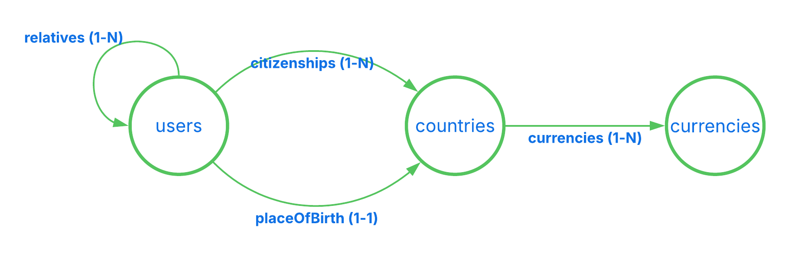

# JsonApi4j Sample Apps

This folder consist of samples of how to use JsonApi4j with various Java framework e.g. Spring Boot, Quarkus, etc.

## Domain

Applications implements an imaginable and very simple domain:



## How to run

### Spring Boot example

`mvn -f jsonapi4j-springboot-sampleapp spring-boot:run`

## API Requests

1. Reads first page of users.

```http
GET http://localhost:8080/jsonapi/users HTTP/1.1
```

2. Reads the next page of users.

```http
GET http://localhost:8080/jsonapi/users?page[cursor]=DoJu HTTP/1.1
```

3. Reads user data by id (with revealed 'creditCardNumber') on behalf of the same user (owner).

```http
GET http://localhost:8080/jsonapi/users/1 HTTP/1.1
X-Authenticated-User-Granted-Scopes: users.sensitive.read
X-Authenticated-User-Id: 1
```

4. Reads the same user by id on behalf of another user.

```http
GET http://localhost:8080/jsonapi/users/1 HTTP/1.1
X-Authenticated-User-Granted-Scopes: users.sensitive.read
X-Authenticated-User-Id: 3
```

5. Reads user data by id on behalf of the same user (owner), but without permission granted to a client (OAuth2 scopes).

```http
GET http://localhost:8080/jsonapi/users/1 HTTP/1.1
X-Authenticated-User-Id: 1
```

6. Reads user's 'citizenships' (to-many) resource linkages on behalf of the same user. User has granted the expected OAuth2 scope.

```http
GET http://localhost:8080/jsonapi/users/1/relationships/citizenships HTTP/1.1
X-Authenticated-User-Granted-Scopes: users.citizenships.read
X-Authenticated-User-Id: 1
```

7. Reads user's 'citizenships' (to-many) resource linkages on behalf of the same user - second page. User has granted the expected OAuth2 scope.

```http
GET http://localhost:8080/jsonapi/users/1/relationships/citizenships?page[cursor]=DoJu HTTP/1.1
X-Authenticated-User-Granted-Scopes: users.citizenships.read
X-Authenticated-User-Id: 1
```

8. Reads user's 'placeOfBirth' (to-one) resource linkage.

```http
GET http://localhost:8080/jsonapi/users/3/relationships/placeOfBirth HTTP/1.1
```

9. Reads user's 'relatives' (to-many) resource linkages.

```http
GET http://localhost:8080/jsonapi/users/5/relationships/relatives HTTP/1.1
```

10. Reads two users (id = 1, 4) with related resources through multiple relationships: 'citizenships', 'placeOfBirth', and 'relatives'. 
User with id = 1 is the same user that initiated the request and it has granted access to a client to his sensitive data - "creditCardNumber" is only revealed for this user. 
All requested related resource can be found in "included" section.

```http
GET http://localhost:8080/jsonapi/users?filter[id]=1,4&include=citizenships,placeOfBirth,relatives HTTP/1.1
X-Authenticated-User-Granted-Scopes: users.citizenships.read users.sensitive.read
X-Authenticated-User-Id: 1
```

11. Reads a single user with related resources through multi-level relationships: 'placeOfBirth' and 'placeOfBirth.currencies'. 
All related 'currencies' and 'countries' can be found in "included" section.

```http
GET http://localhost:8080/jsonapi/users/1?include=placeOfBirth.currencies HTTP/1.1
X-Authenticated-User-Granted-Scopes: users.sensitive.read
X-Authenticated-User-Id: 1
```
