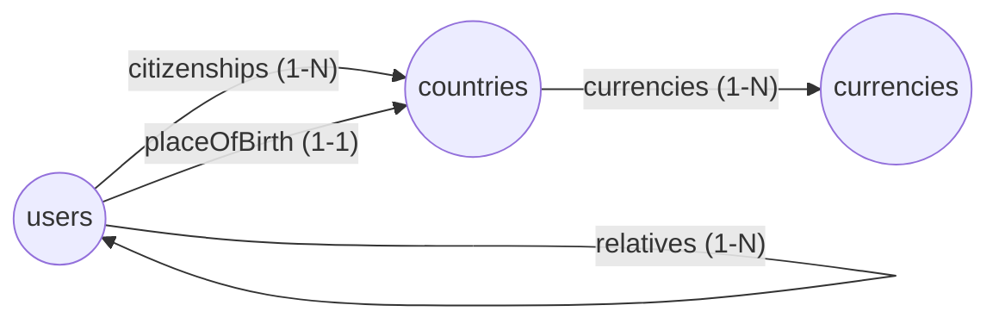

# JsonApi4j Sample Apps

This folder consist of samples of how to use JsonApi4j with various Java framework e.g. Spring Boot, Quarkus, etc.

## Domain

Applications implements an imaginable and very simple domain:


```mermaid
graph LR
    users((users)) -- "citizenships (1-N)" --> countries((countries))
    users -- "placeOfBirth (1-1)" --> countries
    users -- "relatives (1-N)" --> users
    countries -- "currencies (1-N)" --> currencies((currencies))
```

## How to run

All mentioned below apps are running on port `8080` by default so example links should work without extra customizations.

### Spring Boot App example

`mvn -f jsonapi4j-springboot-sampleapp spring-boot:run`

### Quarkus App example

`mvn -f jsonapi4j-quarkus-sampleapp quarkus:dev`

### Servlet App example

`mvn -f jsonapi4j-servlet-sampleapp mvn exec:java`

## API Requests

1. Reads first page of users.

```bash
curl http://localhost:8080/jsonapi/users
```

2. Reads first page of users as authenticated user (with access to some parts of 'attributes').

```bash
curl http://localhost:8080/jsonapi/users \
  -H "X-Authenticated-User-Id: 1"
```

3. Reads the next page of users.

```bash
curl http://localhost:8080/jsonapi/users?page%5Bcursor%5D=DoJu \
  -H "X-Authenticated-User-Id: 1"
```

4. Reads user data by id (with access to sensitive data - 'creditCardNumber') on behalf of the same user (owner).

```bash
curl http://localhost:8080/jsonapi/users/1 \
  -H "X-Authenticated-User-Granted-Scopes: users.sensitive.read" \
  -H "X-Authenticated-User-Id: 1"
```

5. Reads the same user info by id but on behalf of another user.

```bash
curl http://localhost:8080/jsonapi/users/1 \
  -H "X-Authenticated-User-Granted-Scopes: users.sensitive.read" \
  -H "X-Authenticated-User-Id: 3"
```

6. Reads user data by id on behalf of the same user (owner), but without permission granted to a client (OAuth2 scopes).

```bash
curl http://localhost:8080/jsonapi/users/1 \
  -H "X-Authenticated-User-Id: 1"
```

7. Reads user's 'citizenships' (to-many) resource linkages on behalf of the same user. User has granted the expected OAuth2 scope.

```bash
curl http://localhost:8080/jsonapi/users/1/relationships/citizenships \
  -H "X-Authenticated-User-Granted-Scopes: users.citizenships.read" \
  -H "X-Authenticated-User-Id: 1"
```

8. Reads user's 'citizenships' (to-many) resource linkages on behalf of the same user - second page. User has granted the expected OAuth2 scope.

```bash
curl "http://localhost:8080/jsonapi/users/1/relationships/citizenships?page%5Bcursor%5D=DoJu" \
  -H "X-Authenticated-User-Granted-Scopes: users.citizenships.read" \
  -H "X-Authenticated-User-Id: 1"
```

9. Reads user's 'placeOfBirth' (to-one) resource linkage.

```bash
curl http://localhost:8080/jsonapi/users/3/relationships/placeOfBirth
```

10. Reads user's 'relatives' (to-many) resource linkages.

```bash
curl http://localhost:8080/jsonapi/users/5/relationships/relatives
```

11. Reads two users (id = 1, 4) with related resources through multiple relationships: 'citizenships', 'placeOfBirth', and 'relatives'.
User with id = 1 is the same user that initiated the request and it has granted access to a client to his sensitive data - "creditCardNumber" is only revealed for this user.
All requested related resource can be found in "included" section.

```bash
curl "http://localhost:8080/jsonapi/users?filter%5Bid%5D=1,4&include=citizenships,placeOfBirth,relatives" \
  -H "X-Authenticated-User-Granted-Scopes: users.citizenships.read users.sensitive.read" \
  -H "X-Authenticated-User-Id: 1"
```

12. Reads a single user with related resources through multi-level relationships: 'placeOfBirth' and 'placeOfBirth.currencies'.
All related 'currencies' and 'countries' can be found in "included" section.

```bash
curl "http://localhost:8080/jsonapi/users/1?include=placeOfBirth.currencies" \
  -H "X-Authenticated-User-Granted-Scopes: users.sensitive.read" \
  -H "X-Authenticated-User-Id: 1"
```

13. Reads a country with its currencies via 'currencies' relationship. Showcase 'Sparse Fieldsets' capabilities: request only 'name' field for 'countries' and 'symbol' field for 'currencies':

```bash
curl "http://localhost:8080/jsonapi/countries/FI?include=currencies&fields%5Bcountries%5D=name&fields%5Bcurrencies%5D=symbol"
```
